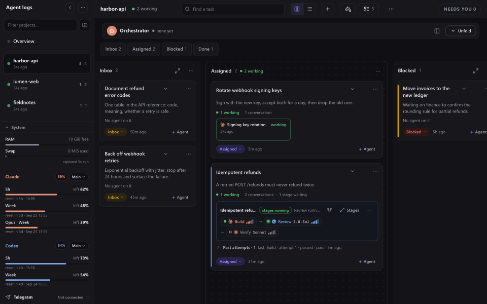
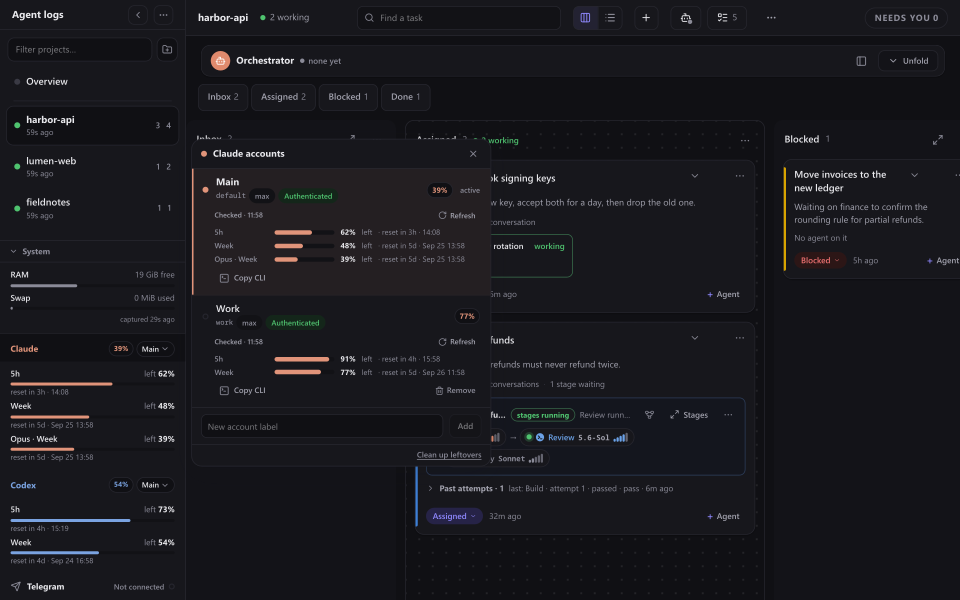
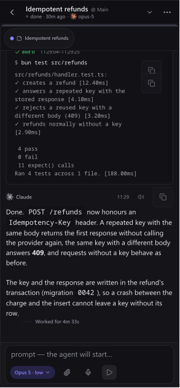

<p align="center">
  <picture>
    <source media="(prefers-color-scheme: dark)" srcset="public/brand/delegatus-lockup-on-dark.svg">
    
  </picture>
</p>

# Agent Log Viewer

Agent Log Viewer is a local web app for running Claude Code and Codex agents
and reading what they do. It shows every agent conversation on your machine
as a readable chat, and lets you give agents work through a task board and
pipelines, from a desktop browser or your phone.



## What you can do

- **Read any agent as a chat.** Claude Code sessions and their subagents,
  Codex rollouts and background shell tasks, with tool calls shown as cards:
  diffs for edits, commands with their output, and the final answer. It
  follows new output live, and every conversation has its own link.
- **Keep work on a board.** Each project has a task board with Inbox,
  Assigned, Blocked and Done columns. A task card shows the agents working on
  it and whether they are working, waiting or done. An Overview board
  collects what is running across all projects.
- **Start and talk to agents.** Launch a Claude or Codex agent from a task or
  the Create button, pick the model and reasoning effort, and send messages,
  images and files from the composer. Interrupt, resume or stop an agent from
  its window.
- **Run pipelines.** A pipeline runs a chain of agent stages (build, review,
  verify, …) in its own git worktree, and sends work back to the builder when
  a reviewer fails it.
- **Hand a project to an orchestrator.** One agent per project can hold the
  orchestrator seat: you tell it what to ship, and it opens pipelines, spawns
  builders and reviewers, and reports back.
- **Switch accounts before a limit stops you.** Add more than one Claude or
  Codex account, see each one's five-hour and weekly usage, and change which
  account an agent runs on.
- **Use it from your phone.** Over your Tailscale network, with a layout made
  for a 390 px screen.
- **Talk instead of typing.** Dictate messages, have answers read aloud, or
  hold a live voice conversation with a Codex agent.
- **Let agents drive it.** The bundled MCP server gives agents the same board,
  tasks, pipelines and conversations you use.
- **English or Ukrainian** interface.

<a id="run"></a>

## Quick start

You need [Bun](https://bun.sh) 1.4 or newer, and the Claude Code and/or Codex
CLI installed and logged in. Then:

```bash
bunx agent-log-viewer
```

This serves the Viewer on `http://127.0.0.1:8898` and opens it in your
browser. It reads the transcripts already in `~/.claude` and `~/.codex`, so
existing sessions show up at once. The same command also starts the runtime
host that launches and supervises agents. Stop both with Ctrl-C.

Useful options:

| Option | Description |
| --- | --- |
| `-p, --port <n>` | Port for the local server (default `8898`). |
| `-H, --hostname <h>` | Bind address (default `127.0.0.1`). |
| `--no-open` | Don't open the browser on start. |
| `--tailscale` | Serve inside your tailnet for phone access (see below). |
| `--new-token` | Create a fresh access key and invalidate old cookies. |
| `--new-operator-token` | Rotate the key that authorizes launching agents. |
| `-v, --version` / `-h, --help` | Print the version / usage. |

### From a clone

```bash
bun install
bun run build
bun bin/cli.mjs --no-open --port 8898
```

The CLI serves the output of the last build, so build first. `bun dev` runs
the app with hot reload; it expects a runtime host you start yourself.

## Reading conversations

Open any card to read the conversation. Tool calls are grouped under a
summary line ("wrote 1 file · patched 1 file · ran 1 command"); expand it to
see each call as a card.


A card reads *working* while the agent is in the middle of a turn and
*done* once its final answer lands, so you can tell a busy agent from one
waiting for you. When an agent stops on a question, the question appears with
its options and your answer goes straight back to it.

## How agents are driven

**Tasks.** A task is a card on its project's board. Add one from the board,
assign an agent to it with **+ Agent**, and move it between columns as the
work goes. Agents can create and update tasks through the MCP server too.

**Pipelines.** A pipeline takes a task and a specification and runs up to
eight stages in a dedicated worktree and branch. Each stage has a role
(builder, reviewer, verifier, and others) that sets the engine, model,
effort and whether it may change the repository. A stage ends by reporting
a verdict: pass moves to the next stage, fail follows the stage's fail edge
(usually back to the builder) within a round budget, and "needs decision"
stops and asks you. A "needs decision" that carries findings on a stage with
a fail edge is routed like a fail, so the findings reach the stage that can
fix them; only a decision without findings, or on a stage without a fail
edge, parks the pipeline for you. The pipeline card on the board shows where it is; open
it to see the stage graph and each stage's conversation side by side.


Reviewers run with read-only access in a conversation of their own, so a
review reads the whole diff without the builder's context. See
[docs/pipelines.md](docs/pipelines.md) for stage definitions, roles and the
HTTP API.

**The orchestrator.** Press **Orchestrator** in a project's header to create
the project's orchestrator seat. You describe what you want shipped; it turns
that into tasks and pipelines, watches them, and comes back to you when a
stage needs a decision. Its standing instructions are written for you and
editable. [docs/orchestrator.md](docs/orchestrator.md) walks through it.

## Accounts and limits

The sidebar shows the active Claude and Codex account with the share of each
usage window left and when it resets. Open an engine's account list to add an
account, refresh its reading, or make another account active. Each account
keeps its own login, and agents launched afterwards use the active one.



## Phone access

Open the setup guide (sidebar **More** menu → **Setup guide**, or the board's
⋯ menu on a phone) and go to **Phone**. If Tailscale is signed in on this
computer, one button, **Turn on phone access**, publishes the running Viewer
inside your tailnet with `tailscale serve --bg`, protects it with the access
key and comes back with the link and its QR code. Nothing restarts. The
choice is remembered in `~/.config/agent-log-viewer/phone-access`, so the next
start publishes again by itself; **Turn off phone access** takes the mapping
down and forgets the choice. When Tailscale is missing, signed out or has no
MagicDNS name, the step says which in one sentence with a link, and picks up
the change by itself.

The same thing from a terminal:

```bash
bunx agent-log-viewer --tailscale
```

Either way the server stays on `127.0.0.1` and is published only inside your
tailnet; the public internet (Funnel) is never used. The terminal prints the
tailnet URL with a QR code; the same QR is in the web app under the sidebar's
**More** menu. The URL carries a 32-character access key; after the first
visit the server sets a cookie for 30 days, and `--new-token` invalidates
every earlier key and cookie. Once phone access is on, every browser, on
this computer too, needs the link once.

Publishing needs Tailscale's operator right. If the button reports that it
is missing, run `sudo tailscale set --operator=$USER` once and press it again.



On a phone the Viewer opens a layout of its own: a project list, the board,
and one conversation at a time with the composer at the bottom. Accounts and
limits are in the board's ⋯ menu. Push notifications, once enabled, tell
you when an agent asks you a question.

Anyone who has the tailnet URL can read every transcript and start commands
through the Viewer, so treat it as a secret.

## Voice

- **Dictation.** The composer's microphone button transcribes speech into the
  message. By default this runs locally with faster-whisper, and no audio
  leaves the machine; run `scripts/setup-whisper.sh` once to install it. Cloud
  backends (ChatGPT through your Codex login, ElevenLabs, Soniox) are a
  per-machine opt-in: pick one in the setup guide's **Voice** step (also the
  **Dictation** menu row) or by right-clicking the microphone button. The
  Voice step saves an ElevenLabs or Soniox key without showing it again and
  checks that dictation answers. `LLV_TRANSCRIBE_BACKEND` overrides the
  choice and locks it. See [docs/transcription.md](docs/transcription.md).
- **Read aloud.** An answer's speaker button reads it with OpenAI, ElevenLabs
  or Soniox speech, billed to your own API key. Right-click the button to pick
  the provider.
- **Voice conversation.** A Codex agent that the Viewer hosts offers a
  continuous voice conversation from its composer.

<a id="connect-an-orchestrator-through-mcp"></a>

## MCP server for agents

The package includes `agent-log-viewer-mcp`, a local stdio MCP server that
runs Viewer services against the same state as the Viewer. With the package
installed globally (`bun add -g agent-log-viewer`), register it under the name
`viewer`:

```bash
# Claude Code
claude mcp add viewer -s user -- agent-log-viewer-mcp
```

```toml
# Codex: ~/.codex/config.toml
[mcp_servers.viewer]
command = "agent-log-viewer-mcp"
```

From a clone, point the command at `bin/mcp-server.mjs` instead, or run
`scripts/install-mcp.sh`, which registers the server for your Claude Code and
Codex configurations and for every account the Viewer manages.

The tools include:

- **conversations:** `list_conversations`, `get_conversation`,
  `conversation_messages`, `search_transcripts`, `send_message`,
  `message_receipt`, `conversation_deliverability`, `conversation_action`
  (interrupt, kill, resume, compact), `spawn_agent`, `suggest_replies`;
- **board and tasks:** `board_snapshot`, `create_task`, `list_tasks`,
  `get_task`, `update_task`;
- **pipelines:** `create_pipeline`, `list_pipelines`, `get_pipeline`,
  `pipeline_action`, `link_task_to_pipeline`, and `stage_report`, which is
  how a stage agent reports its verdict;
- **the orchestrator seat:** `create_orchestrator`, `get_orchestrator`,
  `rotate_orchestrator`, `send_message_to_orchestrator`,
  `seat_tick_settings`;
- **accounts:** `account_limits`, `account_project_binding`,
  `conversation_migration`;
- **the operator and the machine:** `operator_snapshot`, `request_attention`
  (moves your active Viewer to a conversation, task or other target and
  returns once the browser has arrived there; it does not wait for a reply,
  and a Return control takes you back), `agent_activity`,
  `lifecycle_events`, `resources`, `deployment_status`, `deploy_exact_sha`.

Every call takes a `clientRequestId`; repeating a call with the same id and
arguments returns the first result instead of acting twice. Calls to the
`viewer` server render in transcripts as cards whose ids link to the
conversation, task or pipeline they name.

## Configuration

Everything the Viewer keeps lives in one directory,
`~/.config/agent-log-viewer/` (it follows `XDG_CONFIG_HOME`):

- `state/` — tasks, pipelines, the agent registry and other state, mostly in
  SQLite;
- `accounts/` — the extra Claude and Codex accounts you add, each with its own
  login;
- `token`, `transcribe-backend`, and API key files such as
  `elevenlabs-api-key` and `openai-api-key`.

The local transcription environment lives in
`~/.cache/agent-log-viewer/whisper-venv`.

**Language.** The interface is in English or Ukrainian. Switch it under the
sidebar's **More** menu; the default follows your browser. CLI messages
switch to Ukrainian with `LLV_LANG=uk` or a `uk_*` locale.

**Environment variables.** All optional:

| Variable | Effect |
| --- | --- |
| `LLV_LANG` | `en` or `uk`: the CLI message language. |
| `LLV_TRANSCRIBE_BACKEND` | `local` (default), `chatgpt`, `elevenlabs` or `soniox`: fixes the dictation backend and locks the microphone menu. |
| `LLV_WHISPER_MODEL`, `LLV_WHISPER_DEVICE` | faster-whisper model size (default `small`) and device (`cpu` or `cuda`). |
| `LLV_TTS_BACKEND` | `openai`, `elevenlabs` or `soniox`: fixes the read-aloud provider. |
| `LLV_HOST_RETIREMENT_IDLE_HOURS` | Hours a hosted agent's transcript must be quiet before the Viewer may stop its host (default `6`, `0` turns this off). Hosts in the middle of a turn, with a pending question or holding an orchestrator seat are never stopped. |
| `LLV_REAPER_ENABLED` | `1` lets the agent reaper stop leaked agent processes it has verified; unset, it only reports them at `GET /api/lifecycle/reaper`. |
| `VIEWER_PROC_BACKEND` | `linux`, `portable` or `windows`: force the process-discovery backend. |

## Platform support

Linux is the main target. macOS works through a backend that uses `ps` and
`lsof` instead of `/proc`. Native Windows runs the Viewer with Claude Code
(install Claude with its native installer so a `claude.exe` is on `PATH`)
but leaves out Codex, managed accounts, local dictation, the MCP server and
`--tailscale`; run under WSL 2 for those. Windows also has no open-file scan,
so liveness comes from file modification times.

## Security

The server binds to `127.0.0.1` by default. Any non-loopback bind, and
`--tailscale`, require the access key. Endpoints that start or message agents
exist, so anyone who can reach the Viewer can run commands as you. The log
APIs refuse paths outside the known transcript roots.

## Docker

For a pinned deployment the repository ships a `Dockerfile` and
`docker-compose.yml`; a runtime host owns releases and the listener, and
`scripts/rebuild.sh` deploys a revision. See [docs/docker.md](docs/docker.md).

## More

- [ARCHITECTURE.md](ARCHITECTURE.md) — how the scanner, API routes, runtime
  host and UI fit together.
- [CONTRIBUTING.md](CONTRIBUTING.md) — commit identity, the privacy check and
  what CI runs.
- [docs/media/readme/](docs/media/readme/provenance.json) — the screenshots
  above are rendered from an invented demo home by
  `scripts/capture-readme-media.ts`.

## License

MIT
