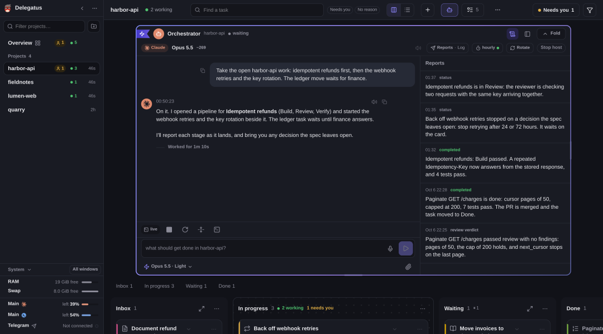
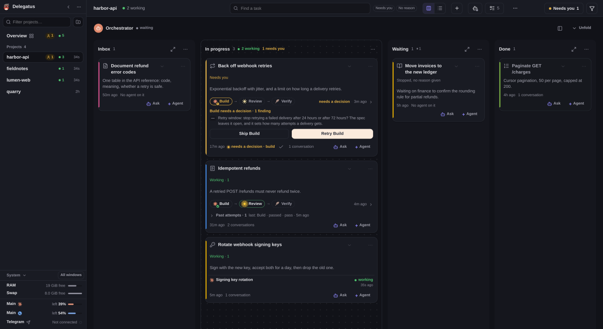
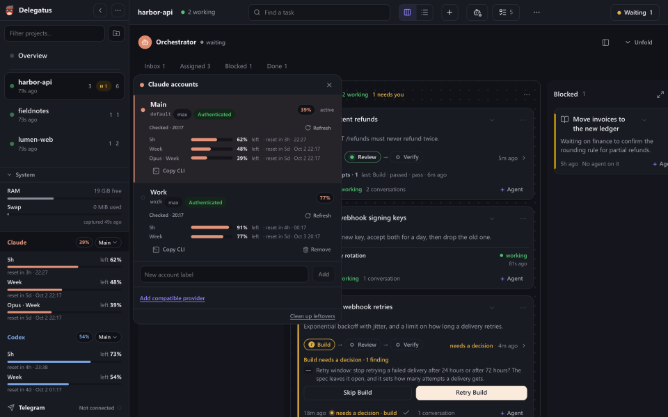
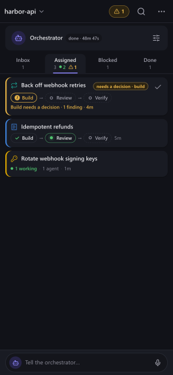
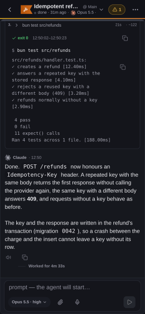
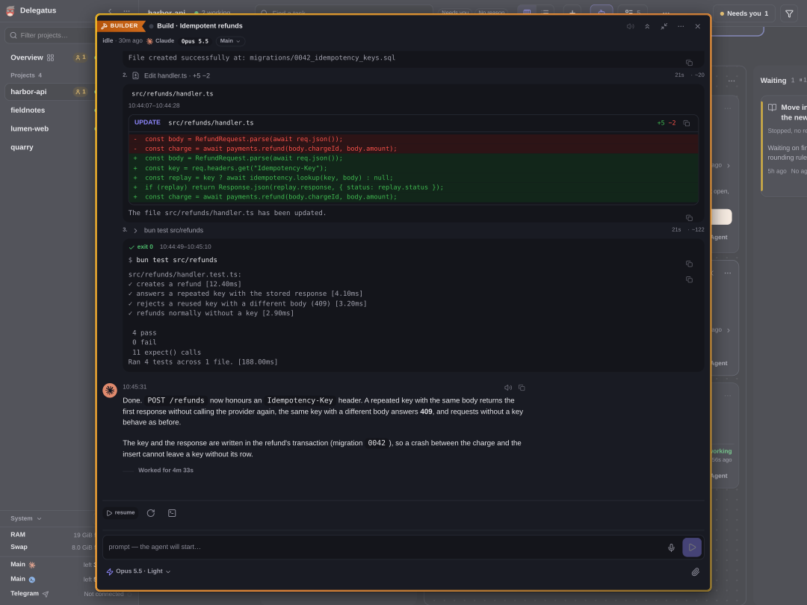

<p align="center">
  <picture>
    <source media="(prefers-color-scheme: dark)" srcset="public/brand/delegatus-lockup-on-dark.svg">
    
  </picture>
</p>

# Delegatus

**Delegate everything.**

Delegatus lets you hand software work to AI coding agents and get it back
done. You tell an orchestrator what you want. It plans the work, starts
Claude Code, Codex and GitHub Copilot agents to do it, has other agents
review and check the result, and reports back. Turn on merging and it merges
what passes review as well. It runs on its own and stops to ask you only when
a decision is yours. You watch and steer from a board in your browser or on
your phone.

Delegatus runs on your own machine with your own agent accounts. What it adds:

- **Every step is on record.** Any agent's conversation opens as a chat, and
  one search covers all of them.
- **Several accounts per engine.** Add more than one Claude, Codex or Copilot
  account and switch before a usage limit stops you.
- **Agents talk to each other.** A Claude Code agent can message a Codex agent
  and the other way round.
- **Shared memory.** Claude and Codex agents can look up what either engine
  learned, and a message you send can carry the memories that fit it.
- **Telegram built in.** Agents post to chats you allow through a bot, and
  read your own Telegram account through a read-only MCP server.
- **Made for a team.** People sign in as themselves, and two machines can
  share one board.

<a id="run"></a>

## Quick start

These steps take you from nothing to an orchestrator working on your project.

1. Install [Bun](https://bun.com) 1.4 or newer:
   `curl -fsSL https://bun.com/install | bash`
2. Install Claude Code or Codex. The orchestrator runs on one of them.
   - Claude Code: `curl -fsSL https://claude.ai/install.sh | bash`
   - Codex: `curl -fsSL https://chatgpt.com/codex/install.sh | sh`

   You can add GitHub Copilot as well: `bun add -g @github/copilot`
3. Start Delegatus: `bunx delegatus-cli`. If neither CLI is found, the start
   output says how to install each.
4. Open `http://127.0.0.1:8898/` if your browser did not open it for you.
5. Follow the setup guide. It signs you in to your agent CLIs, asks for a
   project folder and creates the project's orchestrator.
   If you use an Anthropic Messages compatible provider, choose **Add compatible
   provider** under Claude accounts. Enter its base URL, token, default model
   ID and optional small/fast model ID. **Load models** reads the provider's
   catalogue when available. For OpenCode Go, the base URL is
   `https://opencode.ai/zen/go`. The token stays in a private account file;
   provider usage limits remain unknown.
6. Tell the orchestrator what you want done.

Copilot runs single agents; it cannot run the orchestrator. To keep a
`delegatus` command installed, to change the port, or to see what the command
starts, read [Configuration](#configuration).

### From a clone

Use this to run Delegatus from its source code.

```bash
bun install
bun run build
bun bin/cli.mjs
```

The CLI serves the output of the last build, so build again after you pull.
`bun dev` runs the app with hot reload, and you start the runtime host for it
yourself.

**Update** in the rail menu builds the selected green revision in a separate
release directory, then replaces and verifies the launcher, web server and
runtime host together. If verification fails, the launcher restores the previous
release. Running sessions reconnect and interrupted work resumes.

A recovery web server re-adopts its installation's launcher. If an older
launcher needs upgrading, the dialog offers **Restart launcher** for the user
service that runs it, naming that service, or the exact command for its
terminal. Packaged installs download a published npm release into the user's
cache, so global installation permissions are not needed. Docker's runtime-host
profile uses its deployment coordinator.

Packaged releases that predate this updater need one launch of
`bunx delegatus-cli@latest` to load it. The Update dialog installs a published
version that names the commit it was packed from; for a version published
without one (every version up to 1.9.0) it names the version and asks for
`bunx delegatus-cli@latest`.

**Automatic updates**, off by default, waits for green checks and holds new work
while the current cohort finishes. The dialog shows the work it awaits and asks
for a decision when the drain overruns. A failed automatic apply rolls back and
turns the switch off.

## What it does

This section follows one piece of work from your request to a reviewed pull
request.

Each project gets one orchestrator: the agent you talk to about that
project. You ask it for something in its chat. It opens a task on the project's board
and starts a pipeline for it: one agent builds the change, another reviews
it, and the builder fixes what the review found. The pipeline ends with its
pull request open for you to merge, or merged for you once you turn on
**Merge when the review passes**. The orchestrator watches the agents it
started and files a short report each time a piece lands. When it needs a
decision from you, the task's card says so.

Pipeline stages run on Claude Code or Codex, on your own accounts. You and
the orchestrator can also start single agents, Copilot included. Delegatus
shows every agent conversation on your machine as a chat, including the ones
it did not start.


## How it works

This section covers each part you work with: the orchestrator, the board,
pipelines, agents and accounts, and the phone layout.

### The orchestrator

The orchestrator is the agent you talk to about a project.

A new install creates it in the setup guide, which has four numbered steps:
Engines, Project, Telegram (optional) and Orchestrator. Until a project has
one, the Overview offers **Start with an orchestrator**. On another project,
unfold the orchestrator bar at the top of its board and press **Create the
orchestrator** (on a phone, **Create an orchestrator**). The draft shows the
engine, model, effort and account it will run on, and you can change each.
If that account is signed out, the draft asks you to sign in first. Its
standing instructions come prewritten, and you can edit them before you
confirm. A three-stop walk then points at its composer, the board and
**Needs you**. **Interface walk** in the menu shows it again.

Write to it the way you would message a colleague: "take issues 12 and 14",
"fix the flaky test in the scanner", "review PR 30". For each piece of work
it opens a task, starts a pipeline in a worktree of its own and keeps the
task's card up to date. Delegatus wakes it whenever something is owed: a new
pipeline event, a stage waiting on a decision, a task nobody started. It
answers in its chat and can move your screen to the card where something
landed. A decision it cannot make alone reaches you in its chat and on the
board's **Needs you** counter. While it is busy with a turn, **Ask in
parallel** in its composer sends a side question to a copy of it, which
answers in its own block inside the same chat.
Each time an orchestrator takes its seat, including after a rotation, it
first gets a report on its board: what waits on you, stuck agents, tasks
nothing works on, cards that look safe to close and, for a GitHub project,
open issues ranked by their recorded priority.
In the seat tick panel, **Board maintenance** can also start one maintainer
agent per project on a timer, every 3 hours by default and off until you
switch it on. The panel's text reaches the orchestrator on every wake as
your standing instructions. [docs/orchestrator.md](docs/orchestrator.md)
covers the rest.

When a Delegatus tool fails, the orchestrator offers in its chat to prepare a
bug report. If you agree, a reporter agent gathers the evidence, writes the
report and checks it for private details. The chat then shows the exact
title and body with the agent's privacy judgment, and nothing is filed until
you approve that text. Work for another project goes to that project's
orchestrator, so each board stays with its own seat.

The **Reports** log beside its chat lists what it reported, newest first: a
stage that passed or failed, a review verdict, a blocked pipeline, a
question. Each entry shows its time and kind, and the issue numbers, pull
requests and cards in it are links. New reports arrive live. A toggle in the
orchestrator bar's header hides the log; on a phone the log opens from the
orchestrator chat's bar. Reports can also go to a Telegram chat or forum
topic. Only a project you turn on posts there: use the setup guide's
Telegram step or the **Reports** section in the orchestrator's own row. The
**Bridge reports** switch in the board's ⋯ menu turns reports off for a
project.



### Tasks and the board

The board shows every task in a project and what it is waiting for.

Each task is a card in one of four columns: Inbox, In progress, Waiting and
Done. A card shows its icon and colour, the agents working on it, and each
pipeline with its stages and pull request. A state line under the title says
whether the task is moving, waiting or stopped; the status menu sets the
reason for a wait, such as your decision, another task or a usage limit. A
status note of up to 280 characters, written by an agent, the orchestrator
or a parked pipeline, says what is happening now. Cards order themselves by
that state, with stopped tasks under a divider. A task can be high, normal
or low priority, and high tasks lead the Inbox. **Images** on a card opens every screenshot and render
its agents made. Ctrl+Z undoes your own moves, edits and hides on the board,
and Ctrl+Shift+Z redoes them.

When a task needs you, the foot of its card says why. It can be a question
from an agent, a plan to approve, a permission prompt, a message that did not
arrive, or a stage waiting on your decision. ✓ clears it until something new
comes up. **Needs you** at the top of the board counts what waits across all
projects. Its panel lists each item by project, with the waiting agent's
role, and lets you dismiss an item or answer a permission prompt in place.
While something waits, the funnel (or the F key) dims every card
that does not wait on you.

**Ask** on a card puts that task above the orchestrator's composer as a
chip, so your next message is about it. On a phone the button is on the
task's screen.

The Overview board shows what is running across all projects. A rail beside
the columns lists the agents you have open in cards; click one to jump to
it, or press Alt+J and Alt+K to step between them. You can also add tasks
and start agents on them yourself.

The left sidebar is one panel. Pinned projects come first, then the rest,
then an Archive fold, each section with its count. A project takes one row:
its name, how many items wait on you, how many agents are working and how
long ago something last happened. Below the list, a compact system block
gives one line each to free memory and swap, every account with what is left
of its tightest usage window, Copilot and Telegram. **All windows** in the
block's header adds each account's plan and every window with its reset time.



### Pipelines and review loops

A pipeline runs one task through a fixed set of agent stages, such as build,
review and verify.

A pipeline has up to eight stages and works in its own git worktree and
branch. Each stage has a role, such as builder, reviewer, verifier or
architect. The role sets the engine, model, effort and whether the stage may
change the repository. No stage can take the deployer role, so deploys stay
outside pipelines.

Each stage ends with a verdict. Pass moves to the next stage. Fail follows
the stage's fail edge, usually back to the builder, until the round budget
runs out. "Needs decision" stops and asks you. If a "needs decision" carries
findings and the stage has a fail edge, Delegatus routes it like a fail, so
the findings reach the stage that can fix them. The next stage receives
everything the previous agent wrote before it reported, not just its
summary. Each stage is drawn with a small figure for the model it runs on.

Every review round starts a fresh reviewer with read-only access and no
memory of the builder's conversation, so it reads the whole diff cold. When
the last round fails, the builder fixes those findings once more and the
pipeline moves on, marking the fix as not re-reviewed. You can set a
pipeline to wait for you after that fix. A pipeline stopped on a review says
why in one line and offers **Accept as is** or **Review again**.

**Merge when the review passes**, in the board's ⋯ menu, is off by default.
While it is off, a pipeline ends with its pull request open and the
orchestrator tells you it is ready. Turn it on and Delegatus merges each
pipeline whose reviews passed, one at a time per repository, once every
check on the head has finished green. It updates a branch that fell behind
and leaves conflicts to you. The pipeline shows "waiting for checks", "merge
stopped" or "merged". A stopped merge appears under **Needs you** with **Try
the merge again**. The orchestrator can also hand several reviewed pull
requests to one **merger** stage, which lands them as a single batch pull
request with one commit per original;
[docs/merge-batch.md](docs/merge-batch.md) has the procedure.

Mark a pipeline **Finishes the task** and its task moves to Done when the
pipeline finishes, or, with merging on, when its pull request is merged. An
hourly sweep removes the worktrees of merged pipelines. It skips any
worktree that is still in use or holds unmerged work.

On the task's card a pipeline takes one row: its stages as a chain, its
state, its pull request and the issues that pull request closes. When it
waits on you, the buttons are on that row: skip or retry the stage, or, once
the review budget is spent, close the pipeline or allow **One more round**.
Open the row to see the stage graph beside each stage's conversation, as in
the picture above. [docs/pipelines.md](docs/pipelines.md) covers stage
definitions, roles and the HTTP API. [docs/review-loop.md](docs/review-loop.md)
covers review rounds.

### Agents and accounts

You can start agents yourself and choose which account each one uses.

Start a Claude Code, Codex or GitHub Copilot agent from a task or the Create
button. Pick the model and reasoning effort, then send messages, images and
files from the composer. The agent's window has buttons to interrupt,
resume or stop it. In a Codex conversation, the composer's **Context** toggle
sends the draft into the running turn as context: Auto follows the turn, and a
press overrides it for that card. A Codex agent can also run on a service tier
you set per launch, stage or role. Agents use the bundled [MCP server](#mcp-server-for-agents)
to reach the board, tasks, pipelines and each other's conversations. The
orchestrator does its work through the same server.

Claude and Codex keep separate memories. `search_memory` lets an agent on
either engine query what both have learned. With **Shared memory for this
project** switched on in Settings, each message you send to a Claude or
Codex agent also carries the memories selected as relevant to it. Selection
needs an OpenRouter key, entered in the same dialog, sends redacted context
to that provider and shares the Asks-you monthly cap. Settings shows the
month's counts and says why injection is not running. Under a message that
received memories, a chip such as **Memory · 3** opens to their titles, and
each title opens that memory's file. When memory found nothing that fits, a
quiet line says **Memory: nothing relevant**.

Agents commit with the Delegatus machine identity, so a personal Git
identity stays out of their commits. For a repository listed in
`forge-app-repositories.json` in the state directory, their pushes, pull
requests and merges go out as the Delegatus GitHub App.

Add as many Claude, Codex and Copilot accounts as you like, each with its own
login. The sidebar's system block shows each account with what is left of
its tightest usage window; **All windows** lists every window: five-hour and
weekly for Claude and Codex, the monthly allowance for Copilot, each with the
share left and when it resets. Switch to another account before
one runs out, or move a single agent to a different account. Agents you
start after a switch use the new active account. When a Claude pipeline
stage hits a usage limit, Delegatus moves it to another of the project's
accounts and it carries on. A Claude account can also point at any service
that speaks the Anthropic Messages API: **Add compatible provider** takes its
address, token and models.

The **Activity** page, in the rail menu, shows your time and your agents'
time, per day and per project. On a team install it counts each member's
own time; the owner can also filter by member or add everyone up.



### From your phone

On a phone Delegatus opens a layout built for a small screen.

The board's four columns become tabs you swipe between. Cards that need you
come first, and each card starts with its task's icon in the task's colour.
Hold a card and it lifts with a dock of the four columns: let go over one to
move the task, or in place for the card's menu, where you hide or dismiss
it. The Overview works the same way across every project.

A task, a pipeline or a conversation opens full screen. A pipeline shows its
list of stages, and you answer a decision inside the stage that stopped on
it. A conversation keeps the composer at the bottom. Back returns to the
screen you came from. Accounts and limits are in the board's ⋯ menu.

Turn on push notifications to hear when an agent asks you a question. When
an agent asks for your attention, the phone shows a quiet notice and leaves
your screen where it is. [Phone access](#phone-access) explains how to reach
Delegatus from your phone.

 

## Read any agent as a chat

Delegatus shows every agent conversation on your machine as a readable chat,
whoever started it.

On start it reads the transcripts already in `~/.claude`, `~/.codex` and
`~/.copilot`, so your existing sessions show up right away. That covers
Claude Code sessions and their subagents, Codex rollouts and their
background shell tasks, and Copilot sessions.

Each tool call is a card. An edit shows as a diff, a command shows with its
output, and an image the agent looked at shows as a thumbnail you can open
full size. In the preview the wheel zooms about the cursor and a drag pans;
on a phone two fingers zoom and one pans, and a sideways swipe steps to the
next picture. A summary line groups the calls ("wrote 1 file · patched 1
file · ran 1 command"); expand it to see each one. Next to a call's duration, such as
`352ms · 12.4k`, a number shows how many context tokens its result added, in
four colour bands from quiet under 1 000 to red from 20 000. New output streams in live, and
every conversation has its own link. Press `/` to search your messages
across every project, engine and account, or switch the search to
everything the agents wrote too.



A card reads *working* while the agent is mid-turn and *done* once its final
answer lands, so you can tell a busy agent from one waiting for you. When an
agent stops on a question, you see the question with its options, and your
answer goes straight back to the agent.

A row above the composer steps between your own messages (**Previous mine**,
**Next mine**, or Alt+Up and Alt+Down), passing over wakes, notices and
relays. When Delegatus cannot confirm that a message you sent arrived, a
compact card above the composer says so and offers **Retry** and
**Discard**.

## Phone access

Phone access lets you open Delegatus on your phone through your
[Tailscale](https://tailscale.com) network.

Open the setup guide (sidebar **More** menu → **Setup guide**, or the board's
⋯ menu on a phone) and go to **Phone**. If Tailscale is signed in on this
computer, press **Turn on phone access**. Delegatus publishes itself inside
your tailnet with `tailscale serve --bg`, protects the page with an access
key and shows you the link and its QR code. Nothing restarts. Delegatus
remembers the choice in `~/.config/delegatus/phone-access` and publishes
again on the next start. **Turn off phone access** removes the mapping and
forgets the choice. If Tailscale is missing, signed out or has no MagicDNS
name, the step tells you which one in a sentence with a link, and notices
when you fix it.

To do the same from a terminal:

```bash
bunx delegatus-cli --tailscale
```

The server stays bound to `127.0.0.1` either way, and Tailscale publishes it
only inside your tailnet. Delegatus never uses Tailscale Funnel, which
would expose it to the public internet. The terminal prints the tailnet URL
with a QR code, and the sidebar's **More** menu shows the same QR code. The
URL carries a 32-character access key. After your first visit the server
sets a cookie that lasts 30 days. `--new-token` makes a new key and
invalidates every older key and cookie. Once phone access is on, every
browser, including the ones on this computer, needs to open the link once.

Publishing needs Tailscale's operator right. If the button says it is
missing, run `sudo tailscale set --operator=$USER` once and press the button
again.

Treat the tailnet URL as a secret: anyone who has it can read every
transcript and run commands through Delegatus.

## Voice

Delegatus can take your messages by voice and read answers aloud.

- **Dictation.** The microphone button in the composer turns speech into
  text. By default it runs on your machine with faster-whisper, and no audio
  leaves the computer; run `scripts/setup-whisper.sh` once to install it.
  You can switch this machine to a cloud backend instead: ChatGPT through
  your Codex login, ElevenLabs or Soniox. Pick one in the setup guide's
  **Voice** step, from the **Dictation** menu row, or by right-clicking the
  microphone. The Voice step stores an ElevenLabs or Soniox key without
  showing it again and checks that dictation works.
  `DELEGATUS_TRANSCRIBE_BACKEND` fixes the choice and locks the menu. See
  [docs/transcription.md](docs/transcription.md).
- **Read aloud.** The speaker button on an answer reads it with OpenAI,
  ElevenLabs or Soniox speech, billed to your own API key. Right-click the
  button to pick the provider. With Soniox the answer in view also starts from
  the conversation header, and the first sentence plays as soon as it arrives.
- **Voice conversation.** A Codex agent that Delegatus hosts offers a
  continuous voice conversation from its composer.

## Telegram

Delegatus connects to Telegram in two ways, both from the **Telegram** line
in the sidebar's system block.

- **A bot.** Paste a bot token from @BotFather and choose which chats agents
  may post to. Agents post to those chats and read what the bot receives
  through the MCP server. An agent can also send one photo or an album of
  up to ten (JPEG or PNG, each up to 10 MB) with a caption for each image,
  or a report file up to 20 MB (Markdown, text, log, JSON, CSV, HTML, PDF
  or an image). Files are sent only from the **Document folders** set in
  the panel, `handoff/` in your home by default, and a text file holding a
  password or a key is refused. The orchestrator can send its reports to one of these chats.
  When the installation's owner replies to a report there, the reply goes to
  that project's orchestrator.
- **Your own account.** Enter your `api_id` and `api_hash` from
  my.telegram.org, then scan a QR code with the Telegram app. Delegatus
  registers a read-only Telegram MCP server, named `telegram`, for Claude
  Code and Codex, so your agents can read your chats and cannot write to
  them. The session stays on this machine. The same panel can have an agent
  write a daily report on the chats you pick.

Telegram never stops an agent from starting. If the connection is only down,
the start reconnects it, waiting at most twenty seconds. If Telegram was
never set up or you signed out, agents start without the Telegram tool and
nothing asks you. If Telegram needs you, the agent starts without the tool,
and the orchestrator's seat shows one line with what to do; the tool returns
on the next start after you reconnect.

## Team

One Delegatus can be shared by a team, with each person signed in as themselves.
Until someone sets a team up, nothing changes: a Delegatus used by one
person has no sign-in page and no names.

- **Set up.** Open the ⋯ menu → **Team** and press **Set me as owner**. From
  then on, anyone else who reaches this Delegatus is asked to sign in. The
  access key (phone access, `LLV_TOKEN`) still decides who can reach it at
  all.
- **Invite.** **Team → Invite** makes a link that works once, for seven days.
  The person opens it, types their name and is in.
- **Sign in on another device** with a passkey (on a named HTTPS address, or
  on `localhost`), through the install's Telegram bot, or by approving it
  from a device that is already signed in. The phone QR in the ⋯ menu signs
  the phone in as you.
- **Who did what.** The chat shows the sender's name above each person's
  message. **Team → Activity** lists who sent messages, answered questions,
  started agents and changed tasks. Agents read the same names through the
  MCP tools.
- **Revoke** a member from their row; every session of theirs ends at once.
  To take away their access entirely, also rotate the key (`--new-token`).

If the owner loses every signed-in device, run this on the machine itself:

```bash
delegatus team recover --origin https://your-delegatus.example
# Docker: docker compose exec viewer bun-container bin/cli.mjs team recover --origin https://your-delegatus.example
```

It prints a one-time owner link that works for 15 minutes.
`delegatus team revoke-sessions` signs everyone out everywhere. The design and
its reasoning are in [docs/design/sign-in-and-team.md](docs/design/sign-in-and-team.md).

## Linked installs

Two Delegatus installs, for example your laptop and a server, can share one
board for the projects you choose. Open **Linked installs** from the rail
menu (the board's ⋯ menu on a phone).

- **Pick a role.** The dialog opens on two roles, each with three numbered
  steps. **This machine accepts a connection** is for the machine with an
  HTTPS address, such as a server. **This machine connects to another** is
  for a machine without one, such as a home computer: it opens every
  connection itself and needs no address.
- **This install.** On the accepting machine, enter the address other
  machines use to reach it. A public address needs HTTPS, and the access key
  must be on. **Check this address** confirms that it reaches this machine
  and that the proxy in front of it does not open the board to anyone. When
  this machine cannot test its own address from the inside, the dialog shows
  a warning, "Not checked from here", with the address to check from the
  other machine. A problem that would make linking unsafe stays red.
- **Pair.** On the accepting machine press **Allow a connection**. It shows
  its address beside a pairing code that works once, each with a Copy
  button. On the other machine, **Connect to another install** takes that
  address and code, and a failed attempt says why under the form.
- **Share projects.** Nothing is shared until you choose. Share projects one
  at a time, here or from the board's ⋯ menu, or share every project,
  including new ones. A project needs a git remote to be shared, and it is
  linked once both machines share it.
- **Tasks sync both ways.** A task created, changed or deleted on one machine
  appears on the other within seconds while the board is open. Each task
  belongs to the machine that runs it, and the other machine will not start
  agents or pipelines for it.
- **See the other machine's agents.** Its agents on a shared project show as
  one collapsed, read-only row, such as "On server: 3 agents · 1 working",
  on their task's card or in the Inbox. Only a title and a state cross over.
  A linked task's card also shows its pipeline (stages, states and the
  current stage) and a "Managed on" chip with the machine's name.
- **Revoke** or **Remove** a link at any time from the same dialog.

The design is in [docs/design/linked-installs.md](docs/design/linked-installs.md).

## External relay

A relay service can send this install questions from its own chats.
**External relay** in the rail menu (the ⋯ sheet on a phone), or the
**Relay service** step of the setup guide, pairs the two; **Connect
Celestia** pairs with that service in one click. The install asks
the service for work, so nothing reaches it from outside. Each question is
answered by a one-shot agent on your signed-in Claude or Codex account, with
no shell, no tools and none of your instruction files. The page shows each
relay's state and lets you choose the engine, model and effort it answers
with. The protocol is in [docs/design/relay.md](docs/design/relay.md).

<a id="connect-an-orchestrator-through-mcp"></a>

## MCP server for agents

The MCP server gives any agent the same board, tasks, pipelines and
conversations you see in the browser.

Agents that Delegatus starts get it on their own. To use it from a Claude
Code or Codex session you started yourself, register it once. The package
ships `delegatus-mcp`, a local stdio server that works on the same state as
the web app. Install the package with `bun add -g delegatus-cli` and
register the server under the name `viewer`. The name predates the rename,
and keeping it means tool names (`mcp__viewer__*`) and the permission lists
that name them still match.

```bash
# Claude Code
claude mcp add viewer -s user -- delegatus-mcp
```

```toml
# Codex: ~/.codex/config.toml
[mcp_servers.viewer]
command = "delegatus-mcp"
```

From a clone, point the command at `bin/mcp-server.mjs`, or run
`scripts/install-mcp.sh`. The script registers the server in your Claude
Code and Codex configurations and in every account Delegatus manages.

The tools, by area:

- **conversations:** `list_conversations`, `get_conversation`,
  `conversation_messages`, `search_transcripts`, `search_memory`,
  `send_message`,
  `message_receipt`, `conversation_deliverability`, `conversation_action`
  (interrupt, kill, resume, compact), `spawn_agent`, `suggest_replies`;
- **board and tasks:** `board_snapshot`, `create_task`, `list_tasks`,
  `get_task`, `update_task`;
- **pipelines:** `create_pipeline`, `list_pipelines`, `get_pipeline`,
  `pipeline_action`, `link_task_to_pipeline`, and `stage_report`, which a
  stage agent calls to report its verdict;
- **review flows:** `list_flows`, `get_flow`, `flow_action`;
- **the orchestrator seat:** `create_orchestrator`, `get_orchestrator`,
  `rotate_orchestrator`, `send_message_to_orchestrator`,
  `seat_tick_settings`, `bridge_report` (files an entry in the Reports log),
  `bridge_directive`. Work for another project goes from seat to seat: a
  seat's `create_task`, `create_pipeline` or `spawn_agent` on another project
  is refused with a pointer to `send_message_to_orchestrator`, which
  designates that project's orchestrator first when it has none, unless you
  asked for it and the seat quotes your request in `crossProjectRequest`;
- **accounts:** `account_limits`, `account_project_binding`,
  `conversation_migration`;
- **roles:** `role_presets` reads which engine, model and effort each role
  runs on and, for the orchestrator seat and your own session, changes them
  (the same patch as the Settings agent mapping; a model outside the launch
  catalogue is refused, and every write is logged to `role-presets-audit.jsonl`
  beside `role-presets.json`);
- **updates:** `auto_updates` reads the automatic-update state the Update
  dialog shows and, for the Delegatus project's orchestrator seat and your own
  session, turns automatic updates on or off (the same switch as the dialog;
  each switch is listed in the dialog's history with who made it);
- **bug reports:** `issue_report` takes a Delegatus bug report from preview to
  publication. An orchestrator that hits a Delegatus failure asks you first,
  then an `issue-reporter` writes the report, runs the advisory hint tool and
  re-reads the whole text to make its own privacy judgment. A hint may be a false
  alarm; a clean result proves nothing. The orchestrator shows the exact title
  and body in chat with the agent's judgment and remaining hints as a short list.
  You decide last and may approve text with hints. The approving reply names the
  whole digest of that text. Publication takes the
  preview's digest and reads your reply in the conversation itself: nothing
  the orchestrator says about your answer counts, a reply for an earlier
  wording does not carry over, and one preview is filed once;
- **Telegram bot:** `telegram_bot_chats`, `telegram_bot_send` (posts to a
  chat you allowed in the Telegram panel, signed with the calling
  conversation), `telegram_bot_send_document` (posts a report file from
  a document folder you set in the Telegram panel, `handoff/` in your
  home by default, after a type, size and secret check),
  `telegram_bot_send_media` (a JPEG or PNG photo, or an album, with
  captions, from the same folders), `telegram_bot_messages` (what the bot received, newest first);
- **you and the machine:** `operator_snapshot`, `request_attention`,
  `dismiss_attention`, `agent_activity`, `lifecycle_events`, `resources`,
  `deployment_status`, `deploy_exact_sha`.

`request_attention` moves your open Delegatus view to a conversation, task
or other target and returns once the browser gets there. It does not wait
for your reply, and a Return button takes you back. On a phone it shows a
notice and moves nothing. `dismiss_attention` clears a card's "needs you"
flag until something new comes up, the same as the card's Dismiss.

Every call takes a `clientRequestId`. Repeat a call with the same id and
arguments and you get the first result back, with no second action. Calls to
the `viewer` server show in transcripts as cards, and the ids in them link to
the conversation, task or pipeline they name.

## Configuration

This section lists where Delegatus keeps its data, the command-line options
and the environment variables.

### The command

`bunx delegatus-cli` runs the package without installing a command. To
keep a `delegatus` command installed, run
`bun add -g delegatus-cli`; `dlg` is a short alias for the same command.
`bun add -g` installs into `~/.bun/bin` and needs no root, while
`npm install -g` does on most systems.

The command starts two processes: the web app, and the runtime host that
launches and supervises agents. Ctrl-C stops both. Delegatus listens on
`127.0.0.1` unless you pass `--hostname`, and opens the page in your browser
when it can. Set `DELEGATUS_DEBUG=1` to print startup diagnostics.

Delegatus used to be called Agent Log Viewer. The old `agent-log-viewer`
command still works and prints a one-line notice.

| Option | Description |
| --- | --- |
| `-p, --port <n>` | Port for the local server (default `8898`). |
| `-H, --hostname <h>` | Bind address (default `127.0.0.1`). |
| `--no-open` | Don't open the browser on start. |
| `--tailscale` | Serve inside your tailnet for phone access (see [Phone access](#phone-access)). |
| `--new-token` | Create a fresh access key and invalidate old cookies. |
| `--new-operator-token` | Rotate the key that authorizes launching agents. |
| `-v, --version` / `-h, --help` | Print the version / usage. |

### Files

Delegatus keeps everything in `~/.config/delegatus/`, or under
`XDG_CONFIG_HOME` when you set it. An install from before the rename keeps
its data in `~/.config/agent-log-viewer/`, and `~/.config/delegatus` becomes
a link to it; nothing moves or gets copied.

- `state/`: tasks, pipelines, the agent registry and other state, mostly in
  SQLite.
- `accounts/`: the extra Claude, Codex and Copilot accounts you add, each
  with its own login.
- `token`, `transcribe-backend`, and API key files such as
  `elevenlabs-api-key` and `openai-api-key`.

The local dictation environment lives in `~/.cache/delegatus/whisper-venv`
(`~/.cache/agent-log-viewer/whisper-venv` on an install from before the
rename).

### Language

The interface speaks English and Ukrainian. Switch it under the sidebar's
**More** menu; the default follows your browser. CLI messages switch to
Ukrainian with `DELEGATUS_LANG=uk` or a `uk_*` locale.

### Environment variables

All of these are optional. Each `DELEGATUS_` variable also works under its
older `LLV_` name, and the `DELEGATUS_` one wins when both are set.

Of the variables ending in `_API_KEY`, only `ANTHROPIC_API_KEY`,
`OPENAI_API_KEY`, `OPENROUTER_API_KEY`, `ELEVENLABS_API_KEY` and
`SONIOX_API_KEY` pass on to the agents and commands Delegatus starts.

| Variable | Effect |
| --- | --- |
| `DELEGATUS_AGENT_MEMORY` | `auto` (default), `scope`, `watchdog`, or `off`. Auto uses systemd user scopes on supported Linux installs and an RSS watchdog in Docker and on macOS. |
| `DELEGATUS_AGENT_MEMORY_MAX` | Per-agent ceiling, e.g. `24G`, capped at the shared agent budget. GB means GiB. |
| `DELEGATUS_AGENT_MEMORY_RESERVE` | RAM reserved for the OS and Delegatus, e.g. `24G`; default is 15% rounded up to GiB, at least 4 GiB. |
| `DELEGATUS_LANG` | `en` or `uk`: the language of CLI messages. |
| `DELEGATUS_DEBUG` | `1` prints startup diagnostics in the terminal. |
| `DELEGATUS_TRANSCRIBE_BACKEND` | `local` (default), `chatgpt`, `elevenlabs` or `soniox`: fixes the dictation backend and locks the microphone menu. |
| `DELEGATUS_WHISPER_MODEL`, `DELEGATUS_WHISPER_DEVICE` | faster-whisper model size (default `small`) and device (`cpu`, the default, or `cuda`). |
| `DELEGATUS_TTS_BACKEND` | `openai`, `elevenlabs` or `soniox`: fixes the read-aloud provider. |
| `DELEGATUS_HOST_RETIREMENT_IDLE_HOURS` | How many hours a hosted agent's transcript must stay quiet before Delegatus may stop its host (default `6`; `0` turns this off). Delegatus never stops a host that is mid-turn, has a pending question or holds an orchestrator seat. |
| `DELEGATUS_WORKTREE_SWEEP` | `0` turns off the hourly removal of merged pipelines' worktrees; `dry-run` only reports what it would remove, in `state/worktree-sweep-report.json`. |
| `DELEGATUS_TEMP_SWEEP_MAX_AGE_HOURS` | Age in hours at which the hourly sweep removes an unused Delegatus temp directory (`llv-*`) (default `24`; `0` turns the sweep off). It looks in `/tmp`, `/var/tmp` and the state's `scratch` directory, and never touches a pipeline worktree. The last sweep is in `state/temp-sweep-report.json`. |
| `DELEGATUS_REAPER_ENABLED` | `1` lets the agent reaper stop leaked agent processes it has verified. Unset, it only lists them at `GET /api/lifecycle/reaper`. |
| `VIEWER_PROC_BACKEND` | `linux`, `portable` or `windows`: forces the process-discovery backend. |

### Agent memory

Each agent gets a ceiling computed at launch from RAM and the number of live
hosts. Delegatus reserves at least 4 GiB (15% of RAM) for the core and OS;
`delegatus-agents.slice` caps the combined agent budget. Supported systemd user
installs run agents in separate transient scopes with `MemoryMax`, no swap and
`OOMPolicy=continue`, bound to the Viewer service. Agent descendants inherit a
higher OOM score than the Viewer. No address-space limit is applied.

An existing user-service install needs this drop-in to survive a kill of a
process that still shares the service (workers, builds or watchdog-mode agents):

```sh
mkdir -p "$HOME/.config/systemd/user/delegatus.service.d"
cat > "$HOME/.config/systemd/user/delegatus.service.d/oom.conf" <<'EOF'
[Service]
OOMPolicy=continue
OOMScoreAdjust=100
EOF
systemctl --user daemon-reload
# Run only at a quiet moment, after hosted agents finish:
systemctl --user restart delegatus.service
systemctl --user show delegatus.service -p OOMPolicy -p OOMScoreAdjust
```

Use your service's name if it differs. Expected results are `OOMPolicy=continue`
and `OOMScoreAdjust=100`. The launcher prints a notice when the service still
uses `stop` or `kill`; it never edits the unit. Update the application before
applying the drop-in: the new launcher exits nonzero on Viewer SIGKILL or crash,
so `Restart=on-failure` recovers the Viewer.

Docker and macOS use an RSS watchdog with a shared two-second sampling interval.
On Linux it kills the largest process in an over-budget agent tree after checking
its current ancestry and start identity. On macOS it records the over-limit
descendant as evidence and stops only the identity-verified agent child; surviving
tools may keep running, because cached ancestry cannot authorize descendant kills.
New macOS descendants enroll on their second observation, so first enforcement
can take up to four seconds. Later samples can overshoot by one two-second interval.
The watchdog misses descendants that double-fork out of the tree, does not cap
swap, and cannot attribute a kernel OOM kill. Native
Windows leaves memory isolation off. `DELEGATUS_AGENT_MEMORY=off` is the escape
hatch; forced `scope` fails the launch when the user manager cannot admit it.

A recorded OOM raises a **Needs you** item naming its stage and limit for 24
hours. A fatal stage OOM retries once after memory recovers, retaining its
worktree. A second consecutive OOM, or a 30-minute wait without recovery, stops
for a decision. See [the design](docs/design/agent-memory-isolation.md).

### Agent CPU

On Linux with a systemd user manager, hosts the operator talks to run in
`delegatus-agents.slice` with `CPUWeight=1000`, tmux panes included. Pipeline
and flow hosts, workflow stage and pane-reviewer tmux panes, headless reviews,
gates from `scripts/gate-slot.sh` (the merger's included), workflow setup,
pipeline publication and release installs and builds run in
`delegatus-agents-work.slice`: `CPUWeight=100`, 300% of a CPU per scope and 75%
of the logical CPUs for the whole slice. This placement is independent of the
memory mode. Where it should work and cannot, work is refused with the reason,
a release build included; operator hosts still run.

A pipeline stage, workflow setup or stage, publication install, release install
or build, or gate waits while CPU pressure (`some avg10`) is at or above 20%
and starts once it has stayed below 10% for ten seconds; the wait shows in the
pipeline's or workflow's detail line and in the update step's log. Operator
messages never wait on it.

| Variable | Effect |
|---|---|
| `DELEGATUS_AGENT_CPU` | `off` turns CPU placement off. |
| `DELEGATUS_WORK_SCOPE_CPU_QUOTA`, `DELEGATUS_WORK_CPU_QUOTA` | Percent of one CPU per work scope (default `300`) and for the work slice (default 75% of the CPUs). |
| `DELEGATUS_CPU_PRESSURE` | `off` turns the pressure wait off; `DELEGATUS_CPU_PRESSURE_HOLD` and `DELEGATUS_CPU_PRESSURE_RELEASE` set the thresholds (`20`, `10`). |

To give the service itself `CPUWeight=1000` beside the agents, run
`node bin/install-cpu-placement.mjs`. It writes three files under
`$HOME/.config/systemd/user` and prints the reload and restart that apply them;
restart at a quiet moment. Dedicated CPUs for production need root; see
[the design](docs/design/cpu-placement.md).

## Platform support

Delegatus is built for Linux and also runs on macOS and Windows.

macOS works through a backend that uses `ps` and `lsof` in place of `/proc`.
Native Windows runs Delegatus with Claude Code; install Claude with its
native installer so a `claude.exe` is on `PATH`. Codex, managed accounts,
local dictation, the MCP server and `--tailscale` are missing there, so run
under WSL 2 if you need them. Windows also has no open-file scan, so
Delegatus judges whether an agent is alive from file modification times.

## Security

Anyone who can reach Delegatus can run commands as you, so keep it on your
own machine or behind the access key.

The server binds to `127.0.0.1` by default. Any other bind address, and
`--tailscale`, turn on the access key. Delegatus has endpoints that start
and message agents, which is why reaching it means running commands. The log
APIs refuse paths outside the known transcript folders.

## Docker

The published image is `ghcr.io/latand/delegatus` for `linux/amd64` and
`linux/arm64`. Use `edge` for the latest main build or a version tag to pin a
release. From a repository checkout, start a test instance on port 8901:

```bash
DELEGATUS_IMAGE=ghcr.io/latand/delegatus:edge docker compose --profile test pull viewer-test
DELEGATUS_IMAGE=ghcr.io/latand/delegatus:edge docker compose --profile test up -d --no-build viewer-test
```

The Docker setup is how the maintainer runs Delegatus as a long-running
service.

To try Delegatus, use `bunx delegatus-cli` from the
[Quick start](#quick-start). For a pinned deployment the repository ships a
`Dockerfile` and `docker-compose.yml`. A runtime host owns releases and the
listening port, and `scripts/rebuild.sh` deploys a revision.
[docs/docker.md](docs/docker.md) is the full runbook.

A checkout launcher may also run under a user systemd service. The Update dialog
restarts an older launcher through a transient service outside the unit being
restarted. Obsolete `agent-log-viewer` units still produce the migration notice;
[docs/docker.md](docs/docker.md#moving-off-the-systemd-install) describes moving
those installs to Docker.

## More

- [ARCHITECTURE.md](ARCHITECTURE.md): how the scanner, API routes, runtime
  host and UI fit together.
- [CONTRIBUTING.md](CONTRIBUTING.md): commit identity, the privacy check and
  what CI runs.
- [docs/media/readme/](docs/media/readme/provenance.json): where the
  screenshots come from. `scripts/capture-readme-media.ts` renders them from
  an invented demo home and keeps a vector only after Chrome renders it back
  identical to its PNG.

## License

MIT

## What leaves your machine

Delegatus sends an anonymous install ping to `https://delegatus.org/api/ping`
once per UTC day while the production Viewer runs, starting one minute after
boot. It is on by default. The JSON body contains exactly `id` (an independently
created random UUID stored in the state directory), `v` (version), `os`, `arch`
and `kind` (`packaged`, `checkout` or `docker`). The id is separate from the
linked-install identity. The Worker adds Cloudflare's country code and stores
these values in Analytics Engine, with no IP address. The endpoint receives the
network connection as any HTTPS service does.

Turn it off in **Settings → Anonymous install ping**, or start Delegatus with
`DELEGATUS_TELEMETRY=0` or `DO_NOT_TRACK=1`. Environment opt-outs always override
the switch. Tests, CI, builds, development servers and the Docker test profile
send nothing. Requests time out after five seconds and are attempted at most
once per UTC day, including after failures and restarts.

The first start shows a notice in the product and start output. The ping carries
no paths, host or user names, projects, accounts, engines or usage. Linked-install
traffic still travels directly between the peers you connect; agent providers
and explicitly configured integrations receive the requests you ask them to run.
