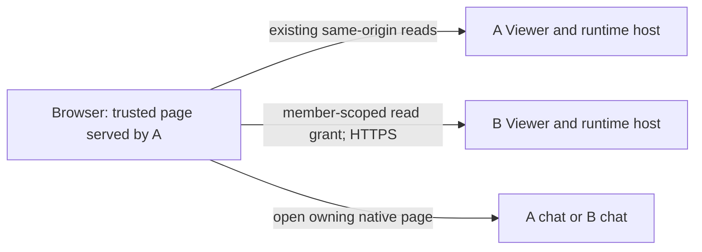

> Instead of syncing boards between linked installs, my browser should make parallel requests: linked installs are publicly reachable and I have an account on both, so from my computer I connect to both, fetch boards and live agents from both APIs in parallel and render them together — then it's only a rendering question. Commands can go to either install. The orchestrator stays my own; one chat opens on one install, another on the other. Right now I switch between two browser tabs. People on the team server must not get access to my personal install; the connection should be one-way (my computer -> server), not server -> my computer, for safety. One agent should critique my idea.

Source: operator request, 2026-09-30 approximately 10:10 UTC, as supplied in the pinned stage brief. The English wording above is reproduced verbatim from that brief. The original Russian speech-to-text and the separate task details were not accessed.

# Critique: one browser reading two Delegatus installs

**Verdict: adopt with changes.** An operator can have one combined view without replicating task stores. The claim that the remaining work is only rendering is wrong. The proposal introduces cross-origin authentication, source-aware identity and command routing, and a different availability contract. A browser dashboard also gives the personal orchestrator no new ability to supervise work on the team server.

Keep the combined page under the operator's control, keep each install authoritative for its records, and start with a read-only desktop slice. Open chats and perform commands on their owning install initially. Direct cross-origin commands require a separate member-bound permission path. Removing all server communication while keeping autonomous supervision from the personal orchestrator would require another mechanism; browser aggregation alone cannot supply it.

## Evidence boundaries and assumptions

This is an independent source audit at `c7e9cf1284857c93219bde5e465253c3c6e283aa`. Repository instructions, the linked-install design, link implementation, team authentication, runtime routes and desktop/phone data consumers were read. No product source changed. No install, peer, live conversation, deployment configuration or other auditor was contacted.

Historical `search_transcripts` and `conversation_messages` checks were not run: they use the live Viewer, which this assignment expressly prohibits. Repository design documents supplied prior design context; their historical descriptions were checked against current source. For example, the earlier linked-install design describes activity scopes, while the current scope type is only `board:sync` (`src/lib/links/state.ts:9`). Its explicit server-side transport rationale remains relevant (`docs/design/linked-installs.md:221`).

The supplied setting establishes A as the personal laptop and B as the public HTTPS team install. **Assumptions:** their origins are different; the ordinary laptop-loopback/public-server case is also cross-site; A's page and assets remain controlled by the operator; B may be compromised. Live cookies, reverse-proxy headers, reciprocal pairings, actual browser settings and installed versions are **unverified**. Nothing below claims a deployed vulnerability or a successful browser flow. All example addresses are synthetic.

A dependency-based probe importing `next/server` failed before exercising the gate because the available dependency tree could not resolve React. An in-memory probe then transpiled the current `sameOrigin.ts`, replaced only its response constructor, and exercised its real decision logic without importing stores or opening sockets: same-origin allowed; cross-site refused with 403; same-site/different-origin refused with 403. This proves the gate's branch behavior. Cookie delivery, proxy behavior and browser CORS still need the isolated browser tests specified below.

## 1. Does the browser already have what it needs?

**It has network reachability under the supplied setting. It lacks an authorized cross-origin API path.** Signing into B in a second tab proves access during B-origin navigation. It does not authorize A-origin JavaScript.

| Layer | Current evidence | Consequence for the proposal |
|---|---|---|
| A, as the page's own origin | Board reads use `/api/board`; the production board store uses ordinary `fetch` (`src/hooks/useBoardState.ts:551`, `:1085`). Runtime reads also use relative URLs (`src/hooks/runtimeBus.ts:32`). | A's existing session/perimeter works for its same-origin calls while A is reachable. Team mode on A still requires its own identity. |
| B's member identity | `llv_member` is host-scoped, HttpOnly, `SameSite=Lax` (`src/lib/team/sessions.ts:109`). The team perimeter and gate verify that cookie (`src/lib/team/gate.ts:112`, `:174`). | A cannot read B's cookie. Default fetch credentials cover same-origin only; `credentials: "include"` still cannot send a Lax cookie on a cross-site fetch. [Fetch documentation](https://developer.mozilla.org/en-US/docs/Web/API/Fetch_API/Using_Fetch#including_credentials). |
| CORS | Ordinary task/runtime responses add no browser-sharing headers (`src/app/api/tasks/route.ts:54`; `src/app/api/runtime/snapshot/route.ts:35`; `src/app/api/runtime/stream/route.ts:25`). `next.config.ts:10` configures **development resource origins**. | Public HTTPS and `allowedDevOrigins` provide no production API CORS contract. Any external proxy additions remain unverified. |
| CSRF and Host checks | `rejectCrossOrigin` checks a declared Host, the Origin hostname and `Sec-Fetch-Site`; the latter rejects even `same-site` (`src/lib/sameOrigin.ts:32`, `:51`). Task writes call it first (`src/app/api/tasks/route.ts:61`; `src/app/api/tasks/[id]/route.ts:39`). | Adding CORS headers alone leaves commands refused. Allowlisting A's hostname alone also leaves commands refused. |
| Peer routes | They bypass team identity deliberately (`src/proxy.ts:71`, `:91`). Their OPTIONS handler asks for a peer token and answers 401 or 404 (`src/app/api/peer/v1/[...path]/route.ts:80`). | A preflight announces header names and carries no peer token. It fails here. The existing peer protocol supplies neither browser sign-in nor a member identity. |
| Team sign-in | Sign-in pages cannot be framed (`src/proxy.ts:79`). Passkey verification checks B's relying-party origin (`src/lib/team/passkeys.ts:196`, `:209`). | Use B's existing sign-in as a top-level page or popup. An embedded login frame and an A-origin passkey prompt are unsuitable shortcuts. |

Cross-origin and cross-site are separate conditions. Two HTTPS subdomains under one site can avoid the cross-site Lax restriction with explicit credential inclusion. They still need CORS and encounter the current CSRF refusal. In the usual unrelated-origin case, changing B's cookie to `SameSite=None; Secure` would still encounter third-party-cookie restrictions. An iframe does not make B's cookies first-party. [Cookie rules](https://developer.mozilla.org/en-US/docs/Web/HTTP/Reference/Headers/Set-Cookie#samesitesamesite-value), [browser CORS documentation](https://developer.mozilla.org/en-US/docs/Web/HTTP/Guides/CORS#third-party_cookies).

For a cookie-based API, B would need an exact allowed origin, credential permission, correct OPTIONS handling and an appropriate CSRF mechanism. Credentialed responses cannot use a wildcard origin. CORS controls which scripts can read a response; it supplies no account identity or permission check. Preflight must succeed before the authenticated request and must not expose data itself. [Fetch standard](https://fetch.spec.whatwg.org/#http-cors-protocol).

**Finding F1 — P1, WRONG-PREMISE: existing sign-in is being treated as direct API authorization.** The blocking points are `sessions.ts:114`, `sameOrigin.ts:72` and the peer OPTIONS handler above. **Show failure:** in an isolated A/B deployment, sign into B, then run A-origin `fetch(B + "/api/tasks", {credentials: "include"})`; require readable authenticated JSON. In the cross-site case the member cookie is withheld and the source provides no applicable CORS response. Attempt a JSON PATCH next; require success and observe the preflight/CSRF refusal. These browser reproductions were not run here. **Fix intent:** create a narrow browser-access boundary on B with member-bound authorization; preserve existing same-origin protections. **Acceptance:** real browser reads work with third-party cookies disabled, unapproved origins fail, and the credential cannot authorize writes unless separately granted.

## 2. One-way trust: the direction of the socket is insufficient

Today's board link already works when only A can reach B. `taskExchange.ts:4` says A makes every request and carries both directions; `taskServe.ts:3` says B never calls out. The schedule implements that pattern (`src/lib/links/schedule.ts:94`). The proposal solves an additional problem only if it changes **what A sends and what B's answers may change**.

Currently A sends its selected project list and task/agent changes in the same exchange that reads B (`src/lib/links/client.ts:178`, `:188`, `:191`). Sharing starts disabled and selects eligible repository projects (`src/lib/links/state.ts:60`, `:88`). Task text/details, status, placement, work links and ownership travel; assignments and attachments are excluded (`src/lib/links/taskWire.ts:1`, `:15`). Agent summaries include title, engine/model, state, task/pipeline references and time; they omit transcript paths and message bodies (`src/lib/links/agentFeed.ts:11`, `:43`). B therefore receives consented A data even though B initiates no connection to A.

B's response can change A's durable tasks through `applyTaskRows`. Winning stamps update text/status and other groups (`src/lib/links/taskApply.ts:75`); a received tombstone deletes a local task in a linked project (`:126`). The machine-owner guard protects ownership transfer (`:84`), while several other groups remain writable through the merge. **Inference:** a compromised B could supply valid newer content or deletion rows within the shared project constraints. The resulting task changes could influence A's orchestrator through its local store. That is data/control exposure; these references do not prove arbitrary code execution.

| Actor | Existing A-initiated board link | Proposed direct view, if correctly bounded |
|---|---|---|
| Ordinary B member | The team gate admits active members; the task list has project/status filters without per-member task filtering (`src/lib/team/gate.ts:174`; `src/app/api/tasks/route.ts:52`). A task copied into B becomes team-readable through that path. | Gains no A account, A credential or A data through aggregation. B commands and anything intentionally uploaded to B remain team-visible under B's existing rules. |
| B server/admin | Sees stored A shared records and link identity. A grant names an install and label, without an A callback URL (`src/lib/links/protocol.ts:106`). | Sees the operator's B identity, request timing, source IP, requested B records, and the A page's Origin on cross-origin calls. A private page path need not be sent; use a no-referrer request policy. Public/tailnet A origins reveal more addressing metadata than a loopback origin. |
| Compromised B | Can return deceptive sync rows accepted under the merge rules. Reciprocal links could add further authority; their live existence is unknown. | Can forge B data and responses, deny service, and learn everything submitted to B. It should have no mechanism to read A records, select A commands or receive A credentials. |
| Compromised A page | Can act with A's existing page authority. | Also gains any B credential entrusted to that page. A-page XSS consequently spans both installs to the extent of the B grant. |

Receiving JSON from B does not itself give B JavaScript execution in A's origin. That isolation fails if the combined page loads executable B assets, renders B markup unsafely, trusts response-supplied API destinations, or runs commands suggested by remote records. Keep B content bounded and inert; construct navigation from the operator-configured origin and opaque owning identifiers. Existing remote summaries render strings as React text (`src/components/kanban/RemoteAgents.tsx:18`); preserve that property.

The combined shell must be served by A or another separately trusted personal client. **A combined shell served by B would put A's readable responses and any A browser credential under B-controlled JavaScript.** Its individual team users need not receive those records for a compromised B to obtain them. Do not add a reciprocal A CORS grant to make that layout work. Existing A mutation defenses must remain in force even when a B page attempts a drive-by local request (`src/lib/sameOrigin.ts:5`). These controls do not prove immunity from every local-service or browser exploit.

**Finding F2 — P1, WRONG-PREMISE: one-way network traffic is being used as a confidentiality guarantee.** The concrete counterexample is the outbound `push` at `client.ts:190` and inbound task application at `taskApply.ts:106`. **Show failure:** in an isolated linked pair, create an explicitly chosen A task containing a synthetic private phrase, share its project and sync from A; assert it never appears on B. Current sync contradicts that assertion. For the new mode, have a hostile B response request an A read, contain executable markup and point at a third origin. **Fix intent:** prohibit A exports and remote-triggered A actions in browser aggregation; keep the shell personal and B responses inert. **Acceptance:** network evidence contains no A task/chat data or credentials sent to B, B cannot initiate a supported A operation, and the old sync is not silently left exporting the same project. Prior disclosures cannot be undone by changing the transport.

### Credentials and attribution

Copying B's `LLV_TOKEN` into browser storage is unacceptable. It is an install-wide perimeter credential. In team mode a bearer read bypasses member-session identity (`src/lib/team/gate.ts:166`); `teamActor` deliberately never treats Authorization as a human identity (`src/lib/team/actor.ts:22`). A bearer-only human write consequently lacks the required member actor. The peer grant is equally unsuitable: its only scope is `board:sync`, and its stored type has no member binding (`src/lib/links/state.ts:9`, `:19`).

Prefer a new, short-lived **read-only B member grant**, issued after B-origin sign-in and explicit approval of the A origin and selected B projects. Bind it to the active B member/session, its granted resources and the intended origin. Recheck revocation and membership on every read. Keep it in A-page memory for the first slice. SessionStorage, localStorage and IndexedDB remain readable by same-origin scripts; moving a token between those stores does not protect it from XSS. [OWASP storage guidance](https://cheatsheetseries.owasp.org/cheatsheets/HTML5_Security_Cheat_Sheet.html#local-storage). Namespace B caches by their authenticated session/grant as well as install. Expiry, revocation, sign-out and disconnect clear the credential and private B cache; an ordinary network outage can retain labeled last-known data. No revocation can retract data already downloaded or copied by an authorized reader.

The approval flow is new work. A B-origin popup can return a bounded credential message to A, using an exact target origin, checking the received message's origin/source and a one-use request nonce. Retain the opener relationship only for approval, then sever it; test cancellation, popup blocking and unsolicited/navigation messages. Never put credentials into URL query strings, fragments, logs or ordinary chat links. [Browser messaging security](https://developer.mozilla.org/en-US/docs/Web/API/Window/postMessage#security_concerns). Origin binding restricts browser use; a stolen bearer remains usable by non-browser callers that can forge headers. Short lifetime, scopes and revocation define the remaining exposure.

Later direct commands must use a separately approved B member-bound write grant, resolved server-side into the existing actor and authorization path. A claimed account id in the request body is insufficient. Preserve task revisions, operation receipts and audit behavior: task creation resolves `teamActor` and records it (`src/app/api/tasks/route.ts:65`, `:102`); task edits do the same (`src/app/api/tasks/[id]/route.ts:50`, `:79`). Opening the native B chat initially preserves its existing cookie-based attribution.

**Finding F3 — P1: the proposed command path has no B-account authorization contract.** In `src/lib/team/actor.ts:28`, the recognized human identity comes from a member session; neither the peer grant nor the perimeter bearer supplies it. **Show failure:** send a synthetic B task command using only an install bearer or peer token; require an event attributed to the active B member. Current normal routes cannot satisfy that contract. **Fix intent:** keep initial commands on B's native page, and add member-bound delegated writes only through a reviewed authorization adapter. **Acceptance:** task creation, editing, chat sends and agent/pipeline starts name the correct B member, respect that member's permission checks, and stop after session/member revocation. Body-supplied identities cannot impersonate another member. A read grant cannot start work.

## 3. Correctness: combining records changes their meaning

### Projects, tasks and ownership

Repository project ids hash a canonical remote (`src/lib/projects/identity.ts:165`); directory ids hash a local path (`:56`). Group matching repository ids for presentation. Preserve each install's aliases, checkout and source record. Similar display names, matching folder paths and matching task titles cannot establish common identity. Forge renames and local aliases may resolve differently on each install; a guessed browser alias must never widen access or choose a command destination.

Every fetched entity needs a source key, such as `(installId, entityKind, entityId)`. UUID probability supplies no protection against restored or synced copies: replication intentionally preserves task ids (`src/lib/links/taskWire.ts:45`). Two `machine`-absent tasks each mean their own local install (`src/lib/tasks/types.ts:213`; `src/lib/links/linked.ts:68`). Once records are merged, an absent field must be interpreted with the record's source. Otherwise B work can be shown as local A work.

Existing linked tasks complicate cutover. The same id can occur in both APIs with different stamps; ownership may point to one install while either copy has a newer editable group. Picking the first response, the latest wall timestamp, or every matching UUID would respectively discard state, reproduce conflict resolution, or create duplicate cards. Keep legacy replicas explicitly identified during coexistence. Route active runtime operations to the actual owner and expose disagreement. Do not silently discard one copy or clear `machine`/`sync` metadata; an owner change can restart work on the wrong host. The current launch seam expressly refuses tasks that run elsewhere (`src/lib/links/linked.ts:83`).

For the first slice, select a B project without an overlapping legacy sync. For wider adoption, require an explicit mode transition for overlapping projects: stop replication on the connection, determine the authoritative records and owners, and retain existing history. Assess retained copies separately; no destructive cleanup follows from this proposal. A viewing-mode switch cannot retract data already stored on B.

**Finding F4 — P1: there is no definition of a task's authoritative source during coexistence.** Task ids are preserved at `taskWire.ts:45`, ownership is relative at `linked.ts:68`, and two replicas can diverge under `taskApply.ts:75`. **Show failure:** feed the view A/B replicas with the same UUID, different status, a B owner and delayed responses; also feed two local records whose machine field is absent. Assert one explicitly identified logical legacy task, preserved conflicting provenance, and B-only execution routing. **Fix intent:** distinguish source identity, logical replica identity and execution ownership; avoid overlapped projects initially. **Acceptance:** response order never chooses ownership, independently created records remain distinct, conflicting replicas are visible, and enabling aggregation does not resume any legacy sync or start duplicate work.

### Existing consumers assume one install

The board's `sharedStores` map is keyed only by project and its factory uses same-origin fetch (`src/hooks/useBoardState.ts:1071`). Confirmed/persisted boards are likewise keyed by project (`:168`, `:204`). A project's revision from B cannot be compared with A's revision or stored in A's project entry. The runtime transport is a tab-wide singleton (`src/hooks/runtimeBus.ts:644`) with one snapshot/stream origin (`:32`). Stable conversation identity currently contains a conversation id or a path without install identity (`src/lib/accounts/identity.ts:52`). Transcript paths also name files on one host.

Changing those fetch URLs in two places will miss task writes (`src/components/kanban/useTaskMutations.ts:597`), stop/kill receipt polling (`src/hooks/useConversationControl.ts:41`, `:71`), chat/log reads and other actions. Add source-aware transport/context at the participating seams. Do not rewrite every settings/account/Telegram endpoint to accept arbitrary remote origins as part of this slice.

There is a particularly specific failure: the team client wraps **all** `window.fetch` answers and interprets any `401 member_required` as its own session ending (`src/components/team/teamClient.ts:60`). The global guard then covers the page and links to A's `/sign-in` (`src/components/team/TeamSessionGuard.tsx:27`, `:34`). A readable B session-expiry response would therefore obscure a healthy A and offer the wrong sign-in destination.

**Finding F5 — P2: source identity is missing from caches, transports and authentication errors.** The concrete locations are the board map at `useBoardState.ts:1071`, runtime singleton at `runtimeBus.ts:644` and global fetch watcher at `teamClient.ts:60`. **Show failure:** bind the same project to A revision 80 and B revision 3; switch between them and delay A's response. Then return B's `member_required`. Require separate stores and a B-only reauthentication prompt while A remains usable. **Fix intent:** key participating stores, cursors, mutations and auth/error state by install; remove remote responses from the local global sign-in trigger. **Acceptance:** neither source overwrites the other's cache, a late response cannot cross source or view generations, and expired B access does not block A.

### Live agents, ordering, chat and notifications

The two runtime hosts have independent snapshot sequences and reconnect epochs. Never compare or merge their cursors into a global sequence. Bootstrap/reconnect each source independently; discard its superseded connection generation. Full replacement snapshots can remove missing records without replication tombstones. If incremental events are added, deletions and reset/rejoin semantics still need a source-local contract.

Current remote agents are bounded **summaries**: their id is a truncated hash of local conversation identity, and their stale flag uses the receiver's observation time (`src/lib/links/agentFeed.ts:43`, `:169`). The renderer has no open-chat action (`src/components/kanban/RemoteAgents.tsx:8`). Fetching these summaries in parallel does not make them controllable conversations. The new read projection needs an opaque owning conversation id for supported native navigation, plus state, observation time and truncation/coverage information. Keep unnecessary transcript paths and message bodies out of the aggregate feed.

Build a B chat link from the configured B origin and its returned conversation id, using the existing `#c=` contract (`src/lib/accounts/identity.ts:101`, `:119`). Use a new tab with `noopener` and `noreferrer` for ordinary chat navigation. If the install lacks a stable conversation id, show the limitation or open its native board; do not reinterpret its transcript path on A. Inline remote chat would require remote versions of log tail, composer, attachments, queue, permissions, audio and operation recovery. That scope can wait.

Preserve each source's board order. Use install/id as deterministic tie-breakers in a combined list; label cross-host time sorting as approximate. A future timestamp on B must not force B cards permanently ahead of A or establish causal precedence. Measure freshness from the client's monotonic time since successful observation, with wall time only for the displayed last-read clock. Current replication uses stamped clocks and rejects stamps over an hour ahead (`src/lib/links/stamp.ts:18`; `src/lib/links/taskApply.ts:110`); display aggregation removes that merge clock, while presentation still needs a skew policy.

The existing runtime bus uses native `EventSource(url)` (`src/hooks/runtimeBus.ts:656`). That constructor supplies a credentials option and no arbitrary authorization-header option. A browser bearer therefore needs polling initially or a fetch-based streaming transport later; putting a persistent token in the stream URL would create another disclosure surface. [EventSource constructor](https://developer.mozilla.org/en-US/docs/Web/API/EventSource/EventSource#parameters). Existing member streams recheck their session every 30 seconds (`src/lib/team/streams.ts:19`, `:46`). A future browser-grant stream must also close after revocation; it cannot inherit this cookie-only check automatically.

Existing notification tracking keys by conversation identity (`src/hooks/useAgentChimes.ts:81`). Namespace notifications by install and event/transition identity, seed the initial/reconnected snapshot silently, and label which source needs attention. A cached "working" agent whose source went offline becomes "last seen working"; losing the connection proves neither completion nor process death. Browser suspension/closure also stops client polling. This design supplies foreground notifications; reliable background/phone delivery would need another owner and should be stated separately.

## 4. The personal orchestrator and availability

**The operator's own orchestrator remains on A. Browser aggregation changes nothing about its execution or mandate.** Its default tick sources read local seats, tasks, pipelines and registry (`src/lib/monitor/seatTickSources.ts:553`). The existing linked-task rules skip remote-owned tasks when selecting projects to inspect (`:1379`), and the launch refusal says the owning install's orchestrator starts it (`src/lib/links/linked.ts:91`).

If the operator means "my existing A chat remains my main chat," this design preserves that. If they mean "that same orchestrator autonomously dispatches and supervises B agents," the proposed view does not fulfill it. A's agent cannot read browser memory, borrow B's member cookie or see B's newly fetched board through its existing local tools. Requiring an open tab to relay every observation/command creates an unreliable automation dependency and allows B content to influence an A authority without a deliberate permission boundary.

A later A-to-B agent API can satisfy one-way network reachability without restoring task replication: A initiates reads and commands, B binds an explicit scoped delegation to the operator's B membership, and durable command receipts remain on B. It needs agent-versus-human authorship, permitted projects/actions, cancellation, retry and revocation rules. It should never inherit the browser's broad consent implicitly. If server-to-server calls of every kind are forbidden, manual supervision through B's native interface is the available first-slice behavior.

| Device/state | Who serves the page and what works |
|---|---|
| Laptop, A awake and local page open | A serves the trusted shell. A and B reads can run concurrently; healthy A work remains usable when B fails. |
| Phone, A awake and privately reachable | The phone needs an actual route to A and separate approval for that A origin. A loopback address on the phone points to the phone. The repository's phone-access path targets the running Viewer (`src/lib/access/phoneAccess.ts:137`); it supplies no independent shell. |
| Phone or fresh browser load, A asleep/unreachable | A cannot serve the combined page or answer its API. B's native signed-in page serves B work. A work and A's orchestrator remain unavailable. |
| Already-loaded shell, A subsequently disappears | An optional client policy could keep B reads working from the loaded personal shell until access expires. A records must show stale/unavailable. Reload is unavailable, and existing global reach/auth handling needs adaptation; this behavior is not current proof. |
| Both APIs healthy, one runtime host fails | The affected source can still have a readable board but unavailable live control. Viewer HTTP health alone does not establish runtime availability; runtime routes report an absent/unavailable plane (`src/app/api/runtime/snapshot/route.ts:16`, `:24`). |

Serving the combined shell from B to solve laptop sleep would violate the proposed personal-data boundary. A separately installed trusted client could preserve B visibility while A sleeps, but it cannot run A's sleeping orchestrator or fetch A's current records. An always-on personal host is another deployment choice with its own cost. Neither capability follows from parallel requests.

**Finding F6 — P1, WRONG-PREMISE: displaying B work is being treated as access for A's orchestrator.** The actual sources are local at `seatTickSources.ts:560`, and remote execution is refused at `linked.ts:83`. **Show failure:** create/update a B-only task after the browser fetched it, close the browser and ask A's existing orchestrator to inspect or start that exact B work through its present local tools. Require an authenticated B receipt; browser aggregation adds no route that can produce one. **Fix intent:** preserve A's seat and explicitly scope the first slice to human observation/native B commands. Design an outbound member-bound agent delegation only if autonomous B supervision is required. **Acceptance for full adoption:** whichever supervision model is chosen works with the browser closed and preserves B authorization. A laptop-asleep requirement needs an awake execution host; it cannot pass on browser caching.

### Partial failures and latency

Start source reads together, publish each result when it arrives and settle failures independently. Waiting for an entire `Promise.all` before painting makes the combined view as slow as the slowest source and lets one rejection discard a healthy result. Use independent source state and deadlines; `Promise.allSettled` can collect final outcomes without becoming a paint barrier. Bound payload size and pagination. The existing local files response includes tasks, pipelines, aliases and other metadata (`src/hooks/useFiles.ts:97`); exposing that entire shape to a new browser grant widens scope unnecessarily. `GET /api/tasks` also returns tasks off the board; the source comments explicitly distinguish it from the board projection (`src/app/api/tasks/route.ts:48`).

Keep last-known data visible with its source and last-read age. Distinguish unreachable, sign-in required, permission revoked, unsupported API/version and runtime unavailable. A client may be unable to distinguish network failure from blocked CORS; show an honest connection error, with technical detail available for diagnosis. Never treat an unsuccessful response as an empty board. A successful authoritative replacement can remove vanished records; an incomplete page cannot.

Source-specific retry/backoff and hidden-tab suspension prevent one failing install from generating traffic storms. Rejoining one source must not resubscribe the other. Two live connections, larger DOM/data sets and two installs on different release versions cost resources even without sync; there is no measured latency win from this audit. Parallelism overlaps requests and removes some replication lag, while internet latency and auth handshakes remain.

For future writes, a lost response leaves an **unknown** outcome on its original install. Query that install's original operation id; never fall back to the other host or mint another send automatically. Existing stop/kill control already follows that rule locally (`src/hooks/useConversationControl.ts:19`, `:41`). Batch selection must partition visibly by source, and moving a card between source sections cannot imply task migration.

**Finding F7 — P2: phone entry and partial-source failure have no explicit behavior contract.** Today's reach state is derived from one runtime bus and one files failure streak (`src/hooks/serverReach.ts:97`), while phone access still reaches A's Viewer. **Show failure:** in isolated desktop and phone fixtures, make B time out, revoke B access, kill only B's stub runtime, and remove A after initial load; also start a fresh phone load with A unavailable. **Fix intent:** source-specific status and action availability; B-native entry when A cannot serve; stale data stays labeled. **Acceptance:** A never becomes unusable because B failed; B's native page remains the explicit asleep-laptop fallback; failed reads never erase records or announce agent completion; no fresh combined page or personal-orchestrator continuity is claimed while A is asleep.

## 5. What disappears, what remains, and what is added

The savings are real **only when this connection stops replicating**. Coexistence retains the old machinery and adds the new client path.

| Removed for a migrated, source-owned connection | Still required | Added by browser aggregation |
|---|---|---|
| Task push/pull cursors, rescan/ack recovery (`src/lib/links/taskExchange.ts:51`) | Local task revisions, multiple writers on B, command idempotency and receipts | Member-approved cross-origin read access, preflight/error handling, credential expiry/revocation |
| Cross-install field stamps, merge conflicts and merge-clock admission (`src/lib/links/taskApply.ts:56`) | Display ordering, clock-skew labeling, independent runtime reconnect/reset | Source-qualified entity/cache/event identities and authority routing |
| Replication tombstones and linked-arrival repair (`src/lib/links/taskApply.ts:126`; `src/lib/links/taskRepair.ts:11`) | Local deletion and retained history; stale browser-cache removal on successful snapshots | A coexistence/cutover policy for records already replicated |
| Pair credentials for this board-sync relationship and its server sync timer (`src/lib/links/state.ts:20`; `src/lib/links/schedule.ts:116`) | Separate sign-ins and trusted access to A; other users' unrelated links | Explicit desktop/phone entry and partial-source availability |
| Durable copies of newly fetched B data in A's server task store | B's authoritative runtime and native chat; A's personal seat | A separate agent-to-B control contract if autonomous supervision is expected |

**Over-engineering pass:** no unconditional OVER-BUILT finding is established against the unimplemented two-source read view. Replacing replication with another general sync framework, a global cross-host event log, a CRDT for browser view state or automatic task migration would carry the same difficult state semantics into a second implementation. Cut those from the proposed dual-API slice. Source-owned snapshots, an install-qualified view model and independent read state suffice. A generic proxy accepting arbitrary destinations or an install-wide credential broker would also expand the security boundary beyond this two-install request. Use one explicit B origin and a narrow projection first. These constraints apply to possible future implementations.

The current two native tabs remain a useful baseline: they have first-party sign-in, native command attribution and independent failure. A personal A-side read-only server adapter would also avoid browser CORS/cookie issues and protect a scoped B credential from page scripts, but it would retain A-to-B server requests and dependence on A. It is a reasonable alternative if the operator's priority is eliminating replicated state and inbound trust rather than requiring every read to originate in the browser. The recommended experiment follows the supplied browser-read preference.

## 6. Minimal first slice worth building

Build a reversible **read-only combined desktop view served by A**, with one configured B HTTPS origin and one B project that is not concurrently replicated to A. Local A retains its present behavior. B records have visible source labels and native open-chat/board links. B commands happen on its own signed-in page. This tests whether fewer context switches justify the new authorization and identity work before remote composer and orchestration work begin.

1. Add a small B browser-read boundary. B-origin sign-in/approval issues a short-lived grant bound to member/session, A's exact origin and selected projects. Use opaque, revocable credentials and memory-only client retention. Reuse team-session validation. Configure CORS only for this boundary, including readable auth failures and non-authenticated preflight; leave ordinary APIs and A's CSRF gate intact. No refresh token or background permission in this slice.
2. Serve a bounded, versioned projection of B board-visible tasks and live-agent summaries with owning opaque ids and source/store-generation information. Keep field disclosure explicit. Reuse existing task visibility/runtime projections where they fit; report the feed's coverage and truncation. Poll for the first slice, with a declared cadence and stale threshold tested together. Preserve independent source snapshots and cancellation.
3. Group repository projects for presentation, keeping source-qualified records and per-source health. Render each source as soon as it answers. Build B native chat links from the configured origin and existing conversation hash contract. Keep remote writes, drag migration and arbitrary remote settings out of this experiment.

The first-slice gate must include actual browser evidence from isolated installs/stores. Extend the existing kanban browser harness and phone evidence harness for later phone adoption, as AGENTS.md requires; create no per-issue browser driver. Use ephemeral ports, synthetic members/data and no real install/credential. Cases to prove:

| Check | Required evidence |
|---|---|
| Auth works across unrelated origins | B first-party approval followed by readable A-origin data in desktop browsers with third-party cookies disabled; canceled/blocked approval has a recoverable state. |
| Access closes properly | Unapproved and opaque origins rejected; expired/revoked/session-ended/inactive-member grants rejected; read grant refuses task/chat/spawn/pipeline writes. Preflight reveals no data. |
| A stays private | No A credentials, task details, paths or conversations in B requests; hostile B markup/links/messages cannot issue A operations or escape the configured B destination. A's existing cross-origin mutation refusal stays red for a B page. |
| Identities stay separate | Same project with different revisions, duplicate conversation ids and out-of-order responses preserve source stores. Legacy replicated task fixture exposes overlap instead of silently merging. |
| Runtime and failures stay independent | One source timeout, auth loss, runtime restart/reset and unsupported schema leave the healthy source usable. Only authoritative complete reads remove records. Initial/rejoined snapshots cause no false completion notifications. |
| Native navigation preserves ownership | B agent opens B's canonical chat; missing stable id is explicit. Commands on that page resolve to the B member. No A path is used as a B target. |
| Rendering demonstrates usability | Desktop wide and compact layouts show readable source labels, health, empty/error states and chat controls with no overflow. Phone acceptance later covers its named widths, sign-in flow and A-unavailable entry explicitly. |

Do not retire existing link features globally based on this experiment. Before migrating overlapping real projects, settle F4's record authority and retained-copy policy. Before adding direct browser writes, satisfy F3 across the actual command seams. Before promising one personal orchestrator for both installs, satisfy F6 independently of the rendered board. Full adoption requires evidence for each of those prerequisites.

## Deferred — not currently justified

- Inline cross-origin chat, attachment upload, audio, queue and approval controls: native owning chats already satisfy the requested separation; add them only if native navigation remains the dominant friction.
- Always-on unified phone shell, offline application packaging and background notifications: separate availability work. Initial phone use can enter B directly when A is unavailable. They cannot restore sleeping A execution.
- Autonomous A-to-B agent delegation: mandatory before claiming automatic remote supervision; a read-only browser experiment can establish value without it. Keep it as a separate permission and execution contract.
- Task transfer between installs, unified global scheduling, automatic conflict resolution and cross-host transactional ordering: these exceed combined observation and destination-specific commands.
- A general multi-install/OAuth platform, remote settings proxy and removal of everyone else's sync: the originating request covers one operator and two installs. Keep the first authorization surface small and reviewable.
- Destructive removal of existing replicas or history: no deletion is authorized or necessary to test the view. Retained disclosures and record ownership still require an explicit migration policy.

No ADR was created: this critique recommends a reversible experiment and makes no hard-to-reverse product decision.

## Validation against the originating requirement

| Requirement | Assessment |
|---|---|
| Fetch A/B boards and live agents in parallel; render together | Feasible with independent source state and a new B browser-access boundary. Existing sign-ins/APIs do not provide it. |
| Stop syncing boards | Source-owned viewing removes replication for the migrated connection. Legacy copies and other link users require scoped transition; enabling a new view alone stops nothing. |
| Commands can go to either install | Native owning pages provide the first slice. Direct cross-origin commands need B member attribution and explicit write delegation. |
| One chat opens on each install | Supported by owning-origin native navigation using stable conversation ids; summaries alone supply no chat target today. |
| The orchestrator stays the operator's own | Keep A's seat. Cross-install automatic supervision remains unfulfilled by browser aggregation and needs F6's separate contract. |
| Team users have no access to the personal install; one-way connection | Achievable without A exports, inbound A grants or a B-served combined shell. Current sync already initiates from A while sharing data in both directions. Existing disclosures remain on B until handled separately. |
| Phone and sleeping laptop | The browser proposal supplies no independent page host or execution host. B's native page is the available fallback; a unified always-on experience is a separate product choice. |

The critique is complete. F1–F7 describe work or decisions required before the full idea can pass an implementation review. Current-source conclusions, architectural inferences and unrun browser/deployment checks are distinguished above. Document verification covers source citations, the isolated gate-logic probe, scope/privacy and prose; no rendered product change exists in this stage.
