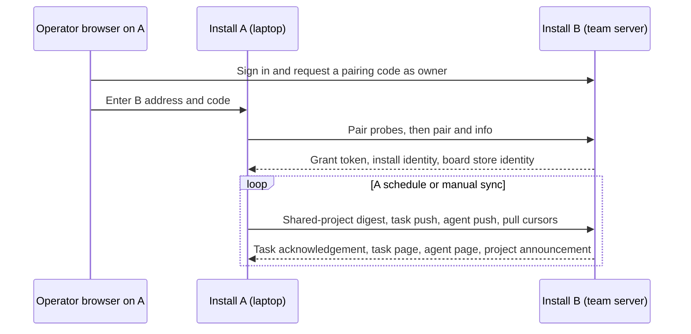
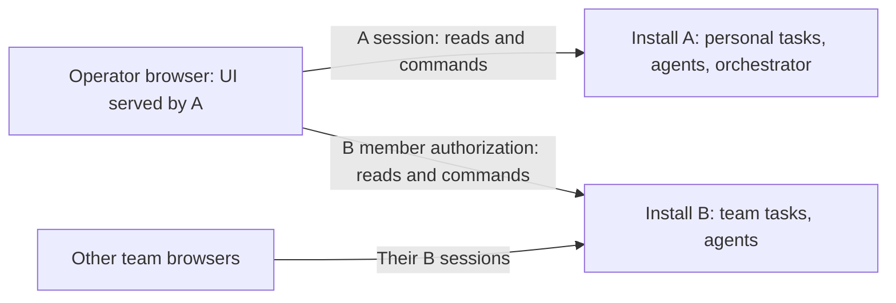

# Linked installs today and a client-side view of two installs

> Check how boards on linked devices sync today. It would be more correct to make parallel requests: linked installs are publicly reachable and I have an account on both, so from my computer I can connect to both, fetch boards and live agents from both APIs in parallel and render them together — then it's only a rendering question. Commands can go to either. The orchestrator stays my own; one chat opens there, another here. Right now I switch between two browser tabs. People on the team server must not get access to my personal install; connection should be one-way (my computer -> server), not server -> my computer, for safety. Run several agents: one critiques my idea, another analyses the current state and compares, what needs to change. Save the task.

Source: the originating-request summary quoted in this stage's pinned specification, operator request dated 2026-09-30, approximately 10:10 UTC. The quotation above reproduces the supplied English summary verbatim. **UNVERIFIED:** the longer Russian speech-to-text original in the task details was unavailable under this stage's prohibition on calling the live Viewer or reading live conversations. Its wording has not been reconstructed. The stage requested that text from the operator while continuing the audit.

This document covers the current state and comparison. It does not coordinate with the independent critique stage or authorize implementation. Install A means the laptop; install B means the team server. In protocol descriptions, A is the connecting side and B is the accepting side. Either installation can have additional outbound links; the one-way claim below concerns this particular pairing.

## Evidence and result

Baseline: `c7e9cf1284857c93219bde5e465253c3c6e283aa`, the pinned worktree head. All source references below are repository-relative `file:line` references at that commit. **Established** means visible in source. **Test contract** means an assertion inspected in a committed test, without claiming that test passed in this session. **Inference** means a consequence of the cited code. Proposed behavior and effort estimates are recommendations.

The audit is complete at the source level. The request warrants a client composition option. It does not justify replacing every existing linked-board installation. The key distinction is that the current pairing already opens connections in one direction, while it copies selected data in both directions. Those copies become ordinary team-board data on B. A direct client view can avoid creating those new copies, but needs authentication, origin policy, install-scoped identities and command routing before the rendering work is sound. Evidence: `src/lib/links/client.ts:178-194`, `src/lib/links/taskServe.ts:41-75`, `src/app/api/tasks/route.ts:33-54`, `src/app/api/tasks/[id]/route.ts:49-61`, `src/hooks/useBoardState.ts:1071-1086`, `src/lib/sameOrigin.ts:51-73`.

No install, peer, service, conversation, deployed configuration or browser session was contacted. Public reachability, actual link direction, live membership, deployed version, performance measurements and rendered appearance are **UNVERIFIED**. Transcript searches were deliberately omitted because they would violate the access fence; this is not evidence that no relevant transcripts exist. Prior work was checked through committed docs, tests and local git history.

## 1. How linking works today

### 1.1 Connection and credentials

The diagram represents separate browser visits during setup, then server-to-server requests initiated by A. Pairing and transport are implemented in `src/lib/links/client.ts:75-119`; the combined exchange is at `src/lib/links/client.ts:178-194`; B dispatches those requests at `src/app/api/peer/v1/[...path]/route.ts:31-77`. A need not publish an address: `ensureSelf()` creates an identity with `publicUrl: null` (`src/lib/links/self.ts:34-52`). B has no callback address in its grant record (`src/lib/links/state.ts:19`). The production scheduler selects outbound `peer` links, excluding revoked ones (`src/lib/links/schedule.ts:94-109`).

| Holder | Credential and authority today | Evidence |
|---|---|---|
| B accepting a pair | Requires its perimeter access key and a usable public-entry check. Mints a code valid for 10 minutes; stores the secret hash; 20 wrong attempts burn it and five recent failures rate-limit that code. | `src/lib/links/protocol.ts:28-50`, `src/lib/links/protocol.ts:80-101` |
| A connecting | Stores B's grant ID and raw 32-byte random token encoded as 43 base64url characters in `links/peers.json`; also stores B's URL, identity, label and board store ID. | `src/lib/links/protocol.ts:105-111`, `src/lib/links/client.ts:115-117`, `src/lib/links/state.ts:20,58-59` |
| B after pairing | Stores the grant token's SHA-256 hash, A's install identity/label and scope `board:sync`. This pair supplies B with no credential for A's ordinary APIs. | `src/lib/links/state.ts:9,19`, `src/lib/links/protocol.ts:105-111` |
| Peer request | Uses `x-delegatus-peer: <grant-id>.<token>`, independently of operator bearer credentials and team cookies. The peer route family bypasses the ordinary identity gate and authenticates the grant itself. | `src/lib/links/client.ts:191-194`, `src/lib/links/protocol.ts:114-121`, `src/proxy.ts:68-73,90-95` |
| Browser on a solo install | With the access key enabled, accepts its own install's `llv_auth` HttpOnly, SameSite=Lax cookie or the perimeter bearer key; a valid `?k=` is converted into a cookie and removed from the URL. With the key unset, the perimeter passes requests. | `src/proxy.ts:23-36,96-99,112-123` |
| Browser on a team install | A live `llv_member` session admits the member; its cookie is HttpOnly, SameSite=Lax and conditionally Secure. The session is verified against that install's active member record. | `src/lib/team/gate.ts:102-116,173-179`, `src/lib/team/sessions.ts:60-80,109-118` |

Credential files use private-directory creation and atomic 0600 writes (`src/lib/links/state.ts:39-47`). This is a filesystem protection, with no per-member ownership encoded in a link or grant (`src/lib/links/state.ts:19-20`). Link settings responses omit raw tokens; grant responses omit hashes (`src/lib/links/protocol.ts:137-140`, `src/lib/links/state.ts:106-114`).

The existing scope permits peer task changes as well as reads. It supplies no conversation-control capability: the implemented peer endpoints are pairing/probing, `info`, `boards/sync` and grant deletion, with authenticated unknown paths returning 404 (`src/app/api/peer/v1/[...path]/route.ts:31-87`, `src/app/api/peer/[...path]/route.ts:7-17`). Uniform unauthorized behavior is an inspected test contract (`src/lib/links/pairing.test.ts:458-494`).

### 1.2 Reachability and the public entry

`publicEntry()` separates an authenticated entry suitable for publication from a local entry that vouches for loopback callers. In Docker it reads the bound entries and gateway configuration on each call; a trusted stable entry without a suitable remote entry is not publishable (`src/lib/links/publicEntry.ts:9-31`). The saved-address check requires an access key, checks the actual response's Host and `vouched` value, and probes loopback Host variants to detect a proxy that accidentally admits internet callers as the operator (`src/lib/links/self.ts:218-249`). A repeats those probes through B's address before pairing (`src/lib/links/client.ts:82-90`).

The board transport accepts only an origin URL with no embedded credentials, path, query or fragment. It resolves the destination before connecting, uses the original Host/SNI, and permits HTTP only when every resolved address is loopback. HTTPS is therefore required even for a non-loopback private-LAN board link (`src/lib/links/client.ts:36-57`). Saved-address policy is broader and can admit private HTTP for the address itself; that does not override the board-token transport restriction (`src/lib/links/self.ts:136-142,218-223`).

**Inference:** for an A-to-B pair, B never needs network access to A. A second independently configured outbound link on B would give B its own caller role and peer token. The actual live topology is **UNVERIFIED**. Evidence: `src/lib/links/schedule.ts:96-100`, `src/lib/links/state.ts:19-20`, `src/lib/links/client.ts:115-117`.

### 1.3 Projects and replicated data

Sharing defaults to nothing. It can select projects individually or set `all: true`, which includes newly recorded eligible projects. Eligibility requires a verified key derived from a recorded network remote; local/file remotes are excluded. Project announcements contain the key and a bounded repository basename. Each side announces its whole shared list; task and agent exchange uses the intersection of the two lists. Thus a peer can learn names of announced projects even when only one side shares them. Evidence: `src/lib/links/state.ts:60-98`, `src/lib/links/protocol.ts:167-188`, `src/lib/links/linked.ts:42-58`, `src/lib/links/client.ts:178-194,331-343`.

| Data | What crosses and where it lands | Evidence |
|---|---|---|
| Task identity and content | UUID, project, full bounded text and details, status, colour/icon/priority, placement/position, work links, execution machine, handover request, timestamps and group stamps. Text crosses even when the sender has not marked it `chosen`; project sharing consents to that content. Received tasks enter the ordinary local task store. | `src/lib/links/taskWire.ts:15-26,42-63`, `src/lib/links/taskApply.ts:56-65,114-165`, `src/lib/links/taskSync.test.ts:203-221` |
| Task board membership | Wire v3 adds `board`. A new arrival defaults done tasks to hidden and hides overflow beyond the receiving board limit, while retaining every task. On an existing row, the sender can fill an unset preference under the owner condition; an explicit local choice stays. This is arrival metadata outside the stamped merge groups. | `src/lib/links/taskApply.ts:68-72,153-158`, `src/lib/links/taskWire.ts:25-26`, `src/lib/tasks/types.ts:138-140` |
| Deletions | Task tombstones and per-project stamp floors live beside tasks in SQLite. A received tombstone deletes the task; later rows for that UUID remain suppressed. | `src/lib/links/tombstones.ts:14-27,41-51`, `src/lib/links/taskApply.ts:126-142` |
| Projects | Shared keys/names and remote store identity are persisted in `board_links`. Sharing does not clone a repository, transfer checkout paths or provision resources. | `src/lib/links/state.ts:88-98`, `src/lib/links/boardLinks.ts:10-12,66-75`; complete pair/sync dispatch: `src/app/api/peer/v1/[...path]/route.ts:31-77` |
| Agent presence | Opaque hash key, project, bounded title, engine/model, working/waiting/done, optional task ID, activity time and compact pipeline/stage state. Sender and receiver retain these in memory. | `src/lib/links/agentFeed.ts:11-20,23-58,146-175,178-209` |
| Pipeline information | Only the compact state embedded in agent rows crosses this protocol. Pipeline records, runs, assignments and controller state stay outside the task wire fields. | `src/lib/links/agentFeed.ts:28-45`, `src/lib/links/taskWire.ts:15-23,77-99` |
| Conversations | No automatic transcript transfer or transcript-path/native-conversation-ID/chat-control field exists in this wire schema. Agent keys hash a local identity; emitted fields exclude the original. User-pasted task content is covered by the caveat below. | `src/lib/links/agentFeed.ts:25,43-58`, `src/lib/links/taskWire.ts:15-23,77-99`; canary test: `src/lib/links/boardSync.test.ts:169-190` |
| Other task metadata | Assignments start empty on arrival. Sources, attachments, deadlines and group hides are absent from the wire schema. | `src/lib/links/taskApply.ts:59-61`, `src/lib/links/taskWire.ts:3-6,15-23,77-99` |
| Accounts, credentials, orchestrator seats | No such records are in the task or agent payloads or peer endpoint dispatcher. Link credentials themselves remain in the link/grant stores. | `src/lib/links/taskWire.ts:15-23`, `src/lib/links/agentFeed.ts:11,43-58`, `src/app/api/peer/v1/[...path]/route.ts:31-87`, `src/lib/links/state.ts:19-20` |
| Activity history | The implemented peer protocol advertises only `boards`. The design's separate activity pull/push slices do not establish an implemented activity feed in this route family. Existing activity mechanisms outside this pairing are a separate scope. | `src/lib/links/protocol.ts:111`, `src/app/api/peer/v1/[...path]/route.ts:59-69`, `docs/design/linked-installs.md:1375-1383,2701-2703,2836-2838` |

Task text/details are copied as stored; validation checks type/length and wire shape, with no content redaction in this encoder. **Inference:** a task can disclose a pasted transcript, a path or a credential written into those fields even though there is no dedicated field for that data. Chosen task titles can also enter agent summaries. Claims about absent structural fields must not be read as a guarantee that all task content is free of sensitive data (`src/lib/links/taskWire.ts:42-59,79-99`, `src/lib/links/agentFeed.ts:39-44`).

Unsharing and revocation stop future exchange and remove link metadata/presence, while already copied task rows remain. This follows from removal deleting only `board_links` keys, link/grant records and agent maps; neither removal path deletes tasks (`src/lib/links/boardLinks.ts:79-83`, `src/lib/links/protocol.ts:124-134,148-152`). The earlier design explicitly preserves copies on unsharing (`docs/design/linked-installs.md:1403-1406`). **Inference:** removing a link cannot restore privacy to content already disclosed to B or its members.

### 1.4 Exchange, merge, repair and execution

| Module | Responsibility in the current flow | Evidence |
|---|---|---|
| `protocol` / `client` | B validates shared-list pages/digests and dispatches tasks and agents; A serializes per-link requests, checks that the link still exists, negotiates lists and loops until work is consumed. | `src/lib/links/protocol.ts:158-214`, `src/lib/links/client.ts:122-143,165-194,255-291` |
| `taskExchange` | A holds pull/push cursors and covered projects. Initial/new-project scans precede log deltas; acknowledged pushes and accepted pulls advance cursors. | `src/lib/links/taskExchange.ts:68-76,89-135,139-203` |
| `taskFeed` | Reads by `(revision, key)` within a revision; filters linked projects and suppresses direct echoes by sender prefix. An expired/future cursor triggers a scan. | `src/lib/links/taskFeed.ts:14-26,63-118,129-166` |
| `taskServe` | B applies a pushed page durably before acknowledging it, then serves the pull page. No task rows move until shared lists agree. | `src/lib/links/taskServe.ts:24-38,41-75` |
| `taskApply` / `taskStamp` | Seven field groups merge by stamp. Store writes stamp local changes and create tombstones with task commits. Equal-stamp replay is inert, except the narrowly defined legacy title recovery. | `src/lib/links/taskApply.ts:75-99,114-169`, `src/lib/links/taskStamp.ts:84-118`, `src/lib/tasks/store.ts:542-560` |
| `taskRepair` | One migration marker repairs older done arrivals owned elsewhere with no board preference; it hides them without discarding tasks. It runs inside the task transaction and requires startup-mutation authority. | `src/lib/links/taskRepair.ts:9-24`; preservation assertions: `src/lib/links/taskSync.test.ts:404-436` |
| `boardLinks` | Persists remote lists, remote store identity, task cursors/coverage and negotiated task wire version; unchanged cursors avoid writes. | `src/lib/links/boardLinks.ts:10-12,66-75,86-107` |
| `runtimeState` | Shares maps/classes between instrumentation and API module graphs in one process using `globalThis`. It does not provide cross-process replication. | `src/lib/links/runtimeState.ts:1-9`; two-bundle test: `src/lib/links/runtimeState.test.ts:60-102` |
| `agentFeed` | Scans current local file entries into bounded summaries and pages deltas with ephemeral epoch/version cursors. Feed reset pages swap the received list only when the last page arrives. | `src/lib/links/agentFeed.ts:74-142,178-209` |
| `schedule` / `boardPresence` | A drives periodic sync and observes recently read boards. The active release starts the timer; each timer checks traffic ownership. | `src/lib/links/schedule.ts:44-90,116-133`, `src/lib/links/boardPresence.ts:5-17`, `src/lib/viewerInstrumentation.ts:522-529` |

The stamp is fixed-width milliseconds, a counter and eight hex characters of install identity. Local stamps rise beyond the project's observed watermark; simultaneous same-group edits compare lexically, including the install prefix as tiebreak. Concurrent changes to different groups can survive together; changes within one group choose one value. Text/details share a group, and colour/icon/priority share another. A future stamp beyond one hour pauses apply. Evidence: `src/lib/links/stamp.ts:1-24`, `src/lib/links/taskStamp.ts:28-37,71-89`, `src/lib/links/taskApply.ts:26-29,75-93,106-113`; merge contract: `src/lib/links/taskSync.test.ts:147-171`.

Execution ownership is separate from replication: absent `machine` means here, and the local stamp step assigns the local install to changed linked tasks without an owner. Ownership received from a peer is accepted only from the task's current owner, except on first arrival. Launch admission, task send/spawn, pipeline admission and host reopening consult ownership. The seat's task-derived wake selection skips tasks running elsewhere. Evidence: `src/lib/links/linked.ts:67-103`, `src/lib/links/taskStamp.ts:93-110`, `src/lib/links/taskApply.ts:58-65,83-85`, `src/lib/tasks/launchMembership.ts:68-71`, `src/app/api/tasks/[id]/send/route.ts:89`, `src/app/api/tasks/[id]/spawn/route.ts:218`, `src/lib/pipelines/engine.ts:6413-6419`, `src/lib/links/adoptionGuard.ts:33-54`, `src/lib/monitor/seatTickSources.ts:1376-1381`.

Do not assume that the design's complete ownership-transfer UI has shipped. The audited normal `PatchTaskInput` exposes no `machine` or `handover` input, and the ownership refusal still describes a future “Run here” control. These fields and owner guards are useful existing data/model machinery; a usable transfer flow is **UNVERIFIED** in this audit (`src/lib/tasks/commands.ts:96-130`, `src/lib/links/linked.ts:83-92`).

### 1.5 Cadence and what the UI reads

| Trigger | Behavior today | Evidence |
|---|---|---|
| Connect / owner presses sync | Connect immediately runs `syncPeer`; manual POST runs the same exchange. | `src/lib/links/client.ts:117-118`, `src/app/api/links/peers/[id]/route.ts:9-17` |
| Local task changes on A | A checks its task revision at most every 10 seconds; a pending linked push advances a healthy link's next call to that tick. This is not an immediate push notification. | `src/lib/links/schedule.ts:16,44-63,101-106` |
| A has a recent project-qualified board read | After a sync, the next call is scheduled 15 seconds later when the presence map says open. A `/api/files?project=...` read marks that project viewed; a read in the last 30 seconds counts as open. The normal UI does not supply that project parameter; see the integration gap below. | `src/lib/links/schedule.ts:78-84`, `src/lib/links/boardPresence.ts:12-17`, `src/app/api/files/route.ts:453-458`, `src/hooks/useFiles.ts:99-105,1210-1212` |
| Recent task movement | Ten-second calls for two minutes. The scheduler's moved count comes from the task exchange, so agent-only changes do not themselves extend this burst. | `src/lib/links/schedule.ts:17-18,81-84,109`, `src/lib/links/client.ts:293-294`, `src/lib/links/taskExchange.ts:65-66` |
| Idle / failure | Healthy idle calls back off from 30 seconds to five minutes. Failure retries back off to five minutes. B sends its changes on the next request it receives from A. | `src/lib/links/schedule.ts:20-21,81-87`, `src/lib/links/taskServe.ts:58-75` |
| Browser task/agent presentation | `/api/files` returns stored tasks plus local files/pipelines/projects. Desktop and phone fetch replicated agent summaries from their own `/api/links/agents` every 15 seconds. | `src/app/api/files/response.ts:918-940`, `src/components/kanban/KanbanBoard.tsx:302-320`, `src/components/mobile/MobileKanban.tsx:707-724` |
| Browser board arrangement | `useBoardState` reads and writes its own `/api/board`, with a ten-second poll and a project-keyed shared store. This arrangement store is a separate surface from linked task replication. | `src/hooks/useBoardState.ts:15,551,692-695,1000-1002,1071-1086`, `src/app/api/board/route.ts:13-34` |

**Source-established integration gap:** the sole production caller of `markBoardViewed` is `/api/files`, which extracts the `project` query parameter. The normal `filesApiUrl` ignores its project argument and emits a global summary URL; `useFiles` calls it with `undefined`. `markBoardViewed(undefined)` returns immediately. The ordinary board read path therefore does not populate this map. The open-board fixture test injects its own signal, so it does not cover that integration. A real-browser reproduction and deployed behavior are **UNVERIFIED**. Evidence: `src/app/api/files/route.ts:453-458`, `src/hooks/useFiles.ts:99-105,1210-1212`, `src/lib/links/boardPresence.ts:5-8`, `src/lib/links/schedule.test.ts:41-46`.

**Inference:** viewing B's board also cannot inform A's process-local presence map. Even a project-qualified A read expires after 30 seconds unless renewed; the healthy SSE file feed removes periodic polling. Remote-origin task or agent changes can therefore await the idle interval when there is no local task push to accelerate it. The timers supply scheduling policies; network time, scans and backlogs add delay. Evidence: `src/lib/links/boardPresence.ts:3-17`, `src/lib/links/schedule.ts:49-63,78-109`, `src/hooks/useFiles.ts:1195-1200`, `src/lib/links/client.ts:165-194`.

The main file feed already supports SSE-driven refresh: a live runtime bus suppresses recurring file polling and `files.revision` events trigger hydration. Runtime transport uses a summary snapshot plus a cursor-resumable EventSource stream with fallback polling. Conversation log tails use another EventSource/poll bus. These are browser-to-own-install transports, separate from linked-board polling (`src/hooks/useFiles.ts:1195-1206,1359-1379`, `src/hooks/runtimeBus.ts:6-12,32-33,644-668`, `src/hooks/logBus.ts:30-44,169-175`).

Remote agents render as collapsed, host-labelled details rows; bound rows attach to their task and unbound rows sit in Inbox. The rows have no chat or command controls. Source: `src/components/kanban/RemoteAgents.tsx:8-25`, `src/components/kanban/KanbanBoard.tsx:2917,2935,3037`, `src/components/mobile/MobileKanban.tsx:1001,1092`. Existing browser-test assertions cover collapse, lack of controls, stale display and geometry at desktop/phone sizes; they were inspected, with rendered results **UNVERIFIED** here (`src/components/kanban/kanbanBoard.browser.test.tsx:84-108`).

### 1.6 Operator API and linking UI

| Route | Read / action | Authorization at the handler |
|---|---|---|
| `/api/links` | Reads this install's address/check/key state; saves address, enables key or checks address. | Bootstrap exception requires key or owner session; writes require owner and refuse staging. `src/app/api/links/route.ts:20-40,43-76` |
| `/api/links/codes` | Lists code status; mints/cancels codes. | Same-origin reads; owner mutations; mint refuses staging. `src/app/api/links/codes/route.ts:9-27` |
| `/api/links/grants` | Lists incoming grant labels/counters; revokes grants. | Same-origin read; owner deletion. `src/app/api/links/grants/route.ts:7-14` |
| `/api/links/peers` | Lists outbound links and project states; connects to a peer. | Same-origin read; owner connect, staging refusal, token removed from answer. `src/app/api/links/peers/route.ts:10-26` |
| `/api/links/peers/[id]` | Manual sync or disconnect, including best-effort remote revocation. | Same-origin and owner. `src/app/api/links/peers/[id]/route.ts:9-24`, `src/lib/links/client.ts:312-328` |
| `/api/links/shared` | Reads effective/known projects and states; replaces or patches sharing. | Same-origin read; owner changes, staging refusal. `src/app/api/links/shared/route.ts:9-25` |
| `/api/links/agents` | Reads this process's received agent summaries for one project. | Same-origin; bounded repo-key validation; ordinary perimeter/team gate also applies. `src/app/api/links/agents/route.ts:8-13`, `src/proxy.ts:68-75` |

`LinkedSettingsDialog` uses accepting/connecting roles, polls a visible code every three seconds, reads sharing/peer/grant state in parallel and presents the union of announced and local projects. `ShareProjectRow` sends a sharing patch from project menus. These are local setup/control surfaces, with no browser connection registry for multiple API origins (`src/components/links/LinkedSettingsDialog.tsx:23-26,60-90,168-188`, `src/components/links/ShareProjectRow.tsx:16-39`).

The docs are valuable design/history, with dated implementation claims. `linked-installs.md` still opens with a September 25 design-only baseline and calls the MVP “what gets built next,” while this commit contains the implementation described above (`docs/design/linked-installs.md:3-15,1354-1358`; implemented exchange: `src/lib/links/client.ts:191-194`). `linking-ux-brief.md` accurately describes the connecting-side reachability model, but its line references and some UI types reflect its earlier baseline; current source controls this audit (`docs/design/linking-ux-brief.md:84-115`, `src/components/links/LinkedSettingsDialog.tsx:16-27`).

### 1.7 What a teammate on B can see or do about A

| Action by an active ordinary B member | Result from the audited code | Evidence |
|---|---|---|
| Read A data that was replicated to B | Can read task text/details and other copied task fields through the ordinary task/board read models; can read received A agent summaries. These reads contain no member/project visibility filter. | `src/lib/team/gate.ts:173-179`, `src/app/api/tasks/route.ts:33-54`, `src/app/api/files/response.ts:918-940`, `src/app/api/links/agents/route.ts:8-13` |
| Read link metadata | Can read peer/grant labels, outbound peer URL/status/call time, and project sharing states. Tokens/hashes are omitted. Handler reads do not require owner. | `src/app/api/links/peers/route.ts:10-12`, `src/app/api/links/grants/route.ts:7`, `src/app/api/links/shared/route.ts:10`, `src/lib/links/protocol.ts:137-140` |
| Edit an A-owned copied task | The PATCH route accepts a signed-in member and invokes the ordinary operator task command without an execution-machine restriction. Eligible field edits can sync back to A. | `src/app/api/tasks/[id]/route.ts:49-61`, `src/lib/team/actor.ts:91-94`, `src/lib/links/taskStamp.ts:93-110` |
| Delete a copied task | DELETE invokes the ordinary delete transaction after the same-origin check; the perimeter/team gate admits an active member. A linked deletion leaves a tombstone for exchange back to A. | `src/app/api/tasks/[id]/route.ts:99-109`, `src/proxy.ts:68-75`, `src/lib/links/taskStamp.ts:112-117` |
| Start/send work on B for an A-owned task | Refused with `TASK_RUNS_ELSEWHERE` at the task launch/send admission seams. Editing a task's words/status remains a different operation. | `src/app/api/tasks/[id]/spawn/route.ts:218`, `src/app/api/tasks/[id]/send/route.ts:89`, `src/lib/links/linked.ts:83-92` |
| Reconfigure pairing/sharing or manually sync/disconnect | Requires owner authority. It is withheld from an ordinary member. | `src/lib/team/actor.ts:71-79`, `src/app/api/links/shared/route.ts:14,22`, `src/app/api/links/peers/route.ts:16`, `src/app/api/links/peers/[id]/route.ts:12,22` |
| Open A's transcript or control its live agent through the pair | No transcript/control endpoint or original conversation identifier is supplied by this protocol. B's remote summary rows contain no controls. | `src/app/api/peer/v1/[...path]/route.ts:31-87`, `src/lib/links/agentFeed.ts:43-58`, `src/components/kanban/RemoteAgents.tsx:13-24` |
| Connect directly to A independently | B membership does not authenticate to A; A checks its own credential/session stores. Whether A is exposed, has a separate B-to-A grant or has shared credentials is **UNVERIFIED**. | `src/proxy.ts:96-132`, `src/lib/team/sessions.ts:60-80`, `src/lib/links/state.ts:19-20` |

The operator's privacy requirement therefore goes beyond one-way sockets. **Inference:** with the ordinary A-to-B pairing, teammates can see and influence A's deliberately shared task copies on B. A task edit can affect work the owning orchestrator later processes. The absent transcript/control endpoints and execution-ownership guard provide the narrower protections described above. Evidence: the member PATCH and replication paths above, and the owner's inbox selection at `src/lib/monitor/seatTickSources.ts:1376-1381`.

There is also a host trust limit: the team gate's own explanation says agents directed by members run as the operator's OS user and could read the perimeter key file. Private filesystem modes are therefore insufficient isolation from such a process. **Inference:** if B separately stores a usable token for A, an agent with that host user's filesystem access could expose it. This audit has not established such a token or access in the live installation (`src/lib/team/gate.ts:94-100`, `src/lib/links/state.ts:20,39-44`).

## 2. Failure modes and costs

### 2.1 Source-established behavior and regression contracts

| Condition / cost | Present handling and practical limit | Source and inspected test contract |
|---|---|---|
| Polling staleness | A idle/failure intervals reach five minutes; B's changes await A. Presence rows become `stale` after 15 minutes since receipt. Agent-only changes do not trigger task-revision acceleration. | `src/lib/links/schedule.ts:49-63,81-109`, `src/lib/links/agentFeed.ts:169-175`; `src/lib/links/schedule.test.ts:33-72`, `src/lib/links/boardSync.test.ts:179-183` |
| Accepting-side health | Project-link states label incoming grants `active` without checking `lastUsed`; only outbound peers carry `active/failing/revoked` transport state. The accepting side's project state is therefore insufficient evidence of recent delivery. | `src/lib/links/client.ts:331-343`, `src/lib/links/state.ts:19-20,106-114`. **Code-level inference.** |
| Open-board cadence integration | Normal file requests omit `project`, so the production presence marker returns without recording an open board. A schedule fixture asserts a 15-second cadence using an injected signal. A regression should exercise the real UI URL and presence marker together; fix intent is an explicit bounded board-presence signal compatible with the global file cache. Acceptance: holding an A board open sustains the intended interval, then closing it restores idle backoff. | `src/hooks/useFiles.ts:99-105,1210-1212`, `src/app/api/files/route.ts:453-458`, `src/lib/links/boardPresence.ts:5-17`; fixture-only contract: `src/lib/links/schedule.test.ts:41-46`. **Source gap; rendered reproduction UNVERIFIED.** |
| Local summary API failure | Both UI implementations preserve their last summary rows on non-OK/error responses. `RemoteAgents` trusts the returned `stale` boolean, so an old row last fetched as fresh can retain that presentation while the local API is unreachable. Fix intent: derive age from `asOf` while displaying source connection state. Acceptance: advance time past the freshness window while all subsequent summary reads fail. | `src/components/kanban/KanbanBoard.tsx:311-315`, `src/components/mobile/MobileKanban.tsx:716-720`, `src/components/kanban/RemoteAgents.tsx:16-21`. **Code-level inference; live/rendered occurrence UNVERIFIED.** |
| Concurrent edits | Per-group last-stamp-wins can discard a competing edit in the same group. Equal stamps retain local values. There is no character merge in the apply path. | `src/lib/links/taskApply.ts:75-99`, `src/lib/links/taskWire.ts:115-123`; `src/lib/links/taskSync.test.ts:147-171` |
| Clock skew | Watermarks protect edits after a previously observed future clock. Stamps over one hour ahead refuse a page and the link backs off; transport timestamps alone do not implement clock correction. | `src/lib/links/stamp.ts:18-24`, `src/lib/links/taskApply.ts:106-113`; `src/lib/links/boardSync.test.ts:637-657` |
| Delete versus edit | A tombstone permanently suppresses that UUID, even a much newer edit. Tombstone/floor rows persist in SQLite; these modules implement no tombstone expiry. | `src/lib/links/taskApply.ts:126-142`, `src/lib/links/tombstones.ts:14-53`; `src/lib/links/taskSync.test.ts:307-320` |
| Cursor history expires / store changes | Rebuild scans consume extra reads/network; cursors persist, with irrelevant-project-only movement saved at most every ten minutes. Store recreation resets exchange identity. Scan and merge are designed to replay safely. | `src/lib/links/taskFeed.ts:69-80,129-166`, `src/lib/links/taskExchange.ts:98-123,259-268`, `src/lib/links/client.ts:208-215`; `src/lib/links/boardSync.test.ts:580-601` |
| Restarted presence feed / many agents | Epoch reset and four possible 50-row pages refill a maximum 200-row feed, capped at 50 per project. Non-running agents older than a day are omitted. This is a bounded view, so it can omit agents a full direct file feed would carry. | `src/lib/links/agentFeed.ts:33-34,91-99,120-142,205-209`; `src/lib/links/agentFeed.test.ts:35-47,85-102` |
| Incompatible or invalid task fields | Invalid legacy content becomes a withheld stub; malformed received tasks fail page decoding. v3 omits `board` for older peers and replays consumed cursors on confirmed upgrade. | `src/lib/links/taskWire.ts:42-63,79-111`, `src/lib/links/taskExchange.ts:114-118,206-226`; `src/lib/links/boardSync.test.ts:659-688,1112-1224` |
| In-flight revoke/disconnect | B reauthorizes after reading the request body. A checks that its credential/store/URL still describe the same link after awaits. Remote grant cleanup can be unconfirmed and is reported. | `src/app/api/peer/v1/[...path]/route.ts:41-53`, `src/lib/links/client.ts:139-150,195-201,312-328`; `src/lib/links/removeRace.test.ts:68-140`, `src/lib/links/pairing.test.ts:361-389` |
| Changed shared lists / simultaneous sync | Lists paginate, compare digests and restart on changes; per-link serialization prevents interleaved pages. These are costs of coordinating two copies. | `src/lib/links/client.ts:122-133,167-176,255-289`, `src/lib/links/protocol.ts:167-188`; `src/lib/links/pairing.test.ts:205-338`, `src/lib/links/boardSync.test.ts:193-223` |
| Cross-bundle stale state | Pinned head shares freshness, agent cursors/feed, task exchanges and sync queues across module graphs. The two-bundle regression asserts one concurrent exchange and current API freshness. These are repaired historical defects, with deployed recovery **UNVERIFIED**. | `src/lib/links/runtimeState.ts:1-9`, `src/lib/links/runtimeState.test.ts:60-102`; git history PR #2359, commit `c7e9cf128` |
| Board crowding / legacy placeholder titles | Current arrival rules retain excess tasks off-board; the repair marker handles older done arrivals. Equal-stamp legacy title recovery is narrow and preserves the original stamp. | `src/lib/links/taskApply.ts:68-89,153-158`, `src/lib/links/taskRepair.ts:9-24`; `src/lib/links/taskSync.test.ts:404-436`, `src/lib/links/boardSync.test.ts:999-1164`; PR #2359 |
| Multiple copies / double-counting | Apply addresses tasks by UUID and suppresses direct echoes, with resync tests asserting uniqueness. Received agents are flattened across links without deduplication and the UI groups by peer label. A new dual reader must not concatenate an authoritative task and its replica, or a local agent and its received summary. | `src/lib/links/taskApply.ts:118-125`, `src/lib/links/taskFeed.ts:89-94`, `src/lib/links/agentFeed.ts:169-175`, `src/components/kanban/RemoteAgents.tsx:10-16`; `src/lib/links/boardSync.test.ts:599-601` |

The last row describes a migration hazard. Deployed duplication is **UNVERIFIED**. Duplicate outbound pairing to a known install/store is rejected, but that check examines outbound peers; grant creation itself has no corresponding duplicate-install check. Repeated/reciprocal pairing and labels that match could therefore yield repeated summary groups. That is a **code-level inference**; occurrence and rendering on real installs are **UNVERIFIED** (`src/lib/links/client.ts:112-114`, `src/lib/links/protocol.ts:105-110`, `src/lib/links/agentFeed.ts:169-175`).

### 2.2 Numeric limits and what they prove

| Limit or assertion | Evidence | Interpretation |
|---|---|---|
| Task page: 200 rows, 512 KiB encoded rows; individual row at most 170,000 bytes | `src/lib/links/taskFeed.ts:17-22,47-51`, `src/lib/links/taskWire.ts:32-33,55-63` | Code bounds. The task-page bound excludes outer envelope, agent/project parts and HTTP/TLS framing. |
| HTTP body/answer bound: 1 MiB; per sync maximum 1,000 requests | `src/app/api/peer/v1/[...path]/route.ts:14-28`, `src/lib/links/client.ts:19,61,165,291` | A sync can be a multi-request catch-up operation. The limit is not a tiny total sync budget. |
| Apply budget: 5,000 changed rows per link per UTC day | `src/lib/links/taskApply.ts:28-30,111-113,167-169` | In-memory budget, reset by process restart. The check occurs before a page, so the last page can take it beyond 5,000. It is not a durable strict per-day ceiling. |
| Idle body ≤200 bytes each way; ≤1 KiB TCP request+answer | `src/lib/links/boardSync.test.ts:448-455`, `src/lib/links/wireMeter.ts:4-5,26-27` | Loopback HTTP assertions were inspected. Measurements in this session are **UNVERIFIED**. The meter excludes real public HTTPS handshake/certificate traffic. |
| Mature idle ≤12 calls/hour; open board ≤240/hour | `src/lib/links/schedule.test.ts:33-46` | Test contracts for scheduler fixtures. Multiplying the TCP budget gives ≤12 KiB/hour at mature idle and ≤240 KiB/hour open, under the test's transport assumptions. |
| Idle calls read no task rows or rewrite unchanged state | `src/lib/links/boardSync.test.ts:801-839`; implementation `src/lib/links/taskFeed.ts:67-70`, `src/lib/links/boardLinks.ts:31-42,97-106` | Does not mean zero file stats/JSON reads, scanner CPU, sockets or browser work. Grant counters and successful call freshness remain in memory; idle grant files are not flushed. `src/lib/links/state.ts:117-137`, `src/lib/links/client.ts:295-299`. |
| CPU ≤2 ms/side/call in fixture; warmed heap growth <256 KiB/1,000 further calls | `src/lib/links/boardSync.test.ts:465-490` | Assertions inspected. Actual CPU, absolute RSS and runtime-specific warm-up are **UNVERIFIED**. |
| RSS/heap on/off comparison and collection-growth workload | `src/lib/links/boardSync.test.ts:493-577,922-945` | Tests calculate RSS differences and assert warmed growth; the 1,000-edit/100-delete workload asserts ≤20 KiB growth in the two new collections. This is not whole-database/WAL size or an indefinite retention guarantee. |

The client uses `agent: false`, so each request opens a new HTTP connection; a real HTTPS deployment pays connection/TLS work beyond the loopback budgets (`src/lib/links/client.ts:50-57`). Agent refresh iterates the latest scan and searches tasks for binding when its scan identity/project set changes; this costs work even though summary pages are bounded (`src/lib/links/agentFeed.ts:23-29,74-108`). A direct client view also consumes per-browser snapshots, event streams and rendering; lower total CPU/network than sync is **UNVERIFIED**, especially with several open clients (`src/hooks/runtimeBus.ts:240,644-668`, `src/app/api/runtime/snapshot/route.ts:28-40`).

### 2.3 Relevant prior work, checked locally

Local `git log -- src/lib/links docs/design/linked-installs.md docs/design/linking-ux-brief.md` and inspection of the named commits establish this sequence. No forge discussion, CI verdict or deployment status was fetched.

| Prior issue/PR evidence | What is relevant now | Current source anchor |
|---|---|---|
| PR #2278, `596f45b65` | The earlier linked-install design, including separate later activity/dispatch scope. | `docs/design/linked-installs.md:17-31,1370-1383` |
| PR #2280, `5faaac3cf` | Public address/access-key/self-check foundation. | `src/lib/links/publicEntry.ts:9-31`, `src/lib/links/self.ts:218-249` |
| PR #2287, `70ab3aa03` | Pairing/shared-project implementation; explicitly referenced by the UX version discussion. | `docs/design/linking-ux-brief.md:410`, `src/lib/links/protocol.ts:80-111` |
| PR #2298, `5e6ec38b5` | Two-way task sync and execution-machine guard. | `src/lib/links/taskExchange.ts:89-203`, `src/lib/links/linked.ts:67-103` |
| PR #2305, `6b95311d9` | Collapsed bounded remote agents; referenced as an optional capability for older peers. | `docs/design/linking-ux-brief.md:588-590`, `src/lib/links/client.ts:24-27,237-244` |
| PR #2325, `6cb4deb60` | Caddy/self-check handling and safe unverified-address pairing when no entry vouches. | `docs/design/linking-ux-brief.md:44-45,154,357-358`, `src/lib/links/protocol.ts:23-39`, `src/lib/links/self.ts:239-247` |
| PR #2336, `057c9d82d` | Two role setup, numbered steps, warning severity and code with address. | `src/components/links/LinkedSettingsDialog.tsx:172-188,201-208`, `docs/design/linking-ux-brief.md:118-208` |
| PR #2359, `c7e9cf128` | Freshness/arrival/title fixes and strict-peer v3 negotiation, already in this audit's baseline. | `src/lib/links/runtimeState.test.ts:60-102`, `src/lib/links/taskRepair.ts:9-24`, `src/lib/links/taskExchange.ts:206-218`, `src/lib/links/boardSync.test.ts:1112-1224` |

These repository-history references establish earlier work. Current behavior was rechecked against the cited source. Some related identifiers appear only in the docs/history; they are distinguished above.

## 3. Mapping the dual-API client onto this code

### 3.1 Recommended target

Run the aggregate UI from A's trusted origin. The operator's browser connects independently to A and B, authenticates independently, and renders two source-labelled views together. Each install remains authoritative for its own tasks, agents, pipelines and conversations. B stores no browser grant for A and initiates no connection to A. B's team UI receives no A dataset or credential. This is a proposed target; the current topology and authorization differences are established in §§1.1 and 1.7.

Configuration of remote origins and browser authorization should belong to the operator's browser/profile, with A's local preferences used only if needed. Do not publish them into B's team board or shared settings. A source selector chooses where a new task or agent is created; an existing resource carries an immutable install reference for every read/action/receipt. A remains the default orchestrator view. No cross-install orchestration or automatic execution transfer is required to combine two boards.

Serve the combined private view from A. Authorizing B's origin to read A would give scripts served by B a path to A from the operator's browser and weaken the requested safety direction. Source URLs and dataset routing are security decisions: browser code from A should treat B's returned text/artifacts as untrusted data, and should never accept executable scripts or navigation/control destinations from that data. These are proposed requirements. Their implementation is **UNVERIFIED**.

### 3.2 Reuse and necessary changes

| Existing part | Reuse | Required change / limit |
|---|---|---|
| `/api/files?view=summary`, `/api/tasks`, project catalog | Existing board summaries, task query filter, ETag/304, compression and deltas. `src/app/api/files/route.ts:453-529`, `src/app/api/files/response.ts:918-940`, `src/app/api/tasks/route.ts:33-54`. | Wrap each fetch in an install transport; carry source identity on all returned resources. The file response can carry local paths and richer local metadata: do not confuse it with the smaller peer payload. Cross-origin access must be explicitly authorized. |
| Board store factory | `createBoardStore` already accepts a fetcher. `src/hooks/useBoardState.ts:438-447,543-551`. | Key shared stores, pending opens, selections, local cache and outboxes by `(install, project)`. The current map uses project alone and the default fetcher is same-origin. `src/hooks/useBoardState.ts:1000,1071-1086`. |
| Runtime SSE | Reuse snapshot/revision reducer, reconnect/cursor-reset logic and bounded fallback. `src/hooks/runtimeBus.ts:6-17,101-110`. | One bus and cursor namespace per install; inject origin/auth into fetch and stream transport. Current URLs/singleton are one-install globals. `src/hooks/runtimeBus.ts:32-33,644-668`. |
| File caches and boot snapshot | Reuse per-feed conditional-read/delta logic. `src/hooks/useFiles.ts:1019-1044`. | Separate certification, generations, overlays and persisted snapshots by install and signed-in identity; clear that source on revoke/sign-out. Current boot store uses one database record named `files`. `src/lib/client/filesSnapshotStore.ts:12-28`. |
| Auth per install | Keep native sign-in and membership checks. `src/lib/team/sessions.ts:60-80`, `src/lib/team/gate.ts:173-179`. | Two open signed-in tabs do not implement cross-origin API authorization. The Lax cookies and current same-origin gates require a concrete browser auth/origin design. |
| Public entry and self-check | Reuse B's authenticated publishable entry and HTTPS endpoint configuration. `src/lib/links/publicEntry.ts:9-31`. | Public reachability is transport setup; it does not enable CORS, expose hidden response headers or issue a member-scoped browser grant. Current peer `OPTIONS` returns unauthorized/404. `src/app/api/peer/v1/[...path]/route.ts:80-83`. |
| Commands/receipts | Existing task mutation and pipeline ports are usable seams. `src/components/kanban/useTaskMutations.ts:595-612`, `src/components/kanban/pipelinePorts.ts:44-77`. | Bind ports to resource origin; qualify event names/overlays, idempotency state and receipt reads. Conversation control currently posts to local `/api/conversation-host` and polls local operation receipts. `src/hooks/useConversationControl.ts:21-25,41-47,65-79`. |
| Conversations | Reuse each install's native chat UI and log routes. Current log stream/session binding: `src/app/api/logs/stream/route.ts:9-17`. | Initially open remote chats at their native origin. Later, embedded panes need per-install log/composer/artifact transports; current log subscribers and EventSource are module globals, and composer requests use relative local endpoints. `src/hooks/logBus.ts:30-44,169-175`, `src/components/TmuxComposer.tsx:3260,4294`. |
| Orchestrator | Keep A's seat/controller and local execution guard. Task-based seat wake selection is local and owner-aware. `src/lib/monitor/seatTickSources.ts:1376-1381`. | Rendering B's board in A's browser must not register B tasks as new local inbox work or alter A's seat. Direct human commands to B are separate from A's orchestrator commanding B. |

Parallel reads are useful, but each source needs its own failure/auth/freshness status. A failed B request must not blank A or make a B command fall through to A. Request URLs, runtime sequence numbers, native IDs, transcript paths, task IDs and project aliases must be interpreted within their issuing install. The current singleton stores, relative URLs and unqualified project keys above are the concrete places this requirement changes.

### 3.3 Browser authorization and CORS

The inspected server has no ordinary multi-origin browser policy: pinned routes reject foreign Host/Origin or `Sec-Fetch-Site` values other than `same-origin`/`none`, and ordinary API responses do not emit the required CORS headers (`src/lib/sameOrigin.ts:32-73`, `src/app/api/board/route.ts:13-34`, `src/app/api/runtime/stream/route.ts:25-31`, `src/app/api/files/route.ts:505-529`). Adding A's hostname to B's Host list does not make a cross-site browser fetch pass the explicit site check (`src/lib/sameOrigin.ts:60-72`). The artifact frame's special opaque-origin CORS serves another purpose and should remain separate (`src/app/api/artifact/frame/[...rest]/route.ts:35-38,57-58`).

The ordinary team cookie and solo perimeter cookie both use SameSite=Lax (`src/lib/team/sessions.ts:109-118`, `src/proxy.ts:28-35`). **Browser-platform assumption, UNVERIFIED here:** credentialed cross-site fetch/SSE cannot rely on those cookies, and changing to SameSite=None/Secure still depends on browser third-party-cookie policy. Same-site HTTPS subdomains may have different cookie outcomes, while remaining different origins for CORS. Real browser behavior must be tested on the intended deployment; no browser policy research or remote probe was permitted in this stage.

| Option | Trade-off | Recommendation |
|---|---|---|
| Credentialed CORS with existing sessions | Least new credential machinery when the actual site topology/browser permits cookies. Requires explicit origin consent, preflight, `credentials: include`, credentialed EventSource, response headers and an origin-aware CSRF gate. Cross-site cookie reliability is unresolved. | Consider only after an isolated browser experiment proves the actual required browser/site combination. Keep normal team membership/revocation. |
| Short-lived browser access grant bound to B member and A origin | Works without depending on B cookies in ordinary cross-site API requests after top-level B sign-in/consent. Needs issuance/revocation, member-aware API enforcement and stream authentication; existing operator-wide `LLV_TOKEN` must not substitute for it. | Preferred default for unrelated origins. Store the grant only in the operator's client, keep it short-lived, and recheck B membership for commands and long streams. Use a fetch-based SSE reader if auth needs a header. |
| Same-origin bridge/iframe or A server proxy | Can reuse parts of native sign-in or server transport, but adds bridge/proxy, trust and credential custody. A proxy changes the requested direct browser topology; a B-hosted bridge still needs a carefully bounded message contract and browser validation. | Deferred unless direct browser auth proves impractical. No proxy on B that stores or retrieves A credentials. |

The bearer key currently admits team reads as the operator but does not itself identify a member for ordinary writes; team writes still need a session or a verified service/agent capability (`src/lib/team/gate.ts:159-179`, `src/lib/team/actor.ts:22-24,28-43`). The peer token instead writes shared tasks through the peer protocol, has no member attribution and has no conversation control (`src/lib/links/state.ts:19`, `src/app/api/peer/v1/[...path]/route.ts:41-77`). Neither credential is an existing per-member dual-API browser session.

A browser grant design should keep CORS admission and user authorization separate. B explicitly admits the selected A origin for this browser protocol, but every request still authenticates and checks the member. A grants no reciprocal B-origin access. Permit only the required methods/headers and expose ETag plus the custom file revision/generation/delta headers used by the existing cache. Handle unauthenticated preflight without serving data; reject `Origin: null` and unknown origins. Apply the same policy to success/error/304 responses. These are proposed acceptance requirements motivated by the current conditional-read path (`src/app/api/files/route.ts:481-525`).

Long streams must end on membership/grant revocation. Current runtime and log streams already bind member sessions and recheck them every 30 seconds; a new header-based member grant needs equivalent enforcement. The current bearer-read branch leaves the source stream unwatched (`src/app/api/runtime/stream/route.ts:25`, `src/app/api/logs/stream/route.ts:11`, `src/lib/team/streams.ts:15-26,46-77`). The runtime/feed implementation inspected here uses SSE; no board WebSocket transport was found in these paths (`src/hooks/runtimeBus.ts:6-12,656`, `src/hooks/logBus.ts:175`).

### 3.4 Data identity, commands and conversations

Use a small install transport interface with a fetch operation, a resumable event stream and origin-owned navigation. Pass it through the existing board/task/pipeline seams before expanding to all chat features. Its caller supplies an install reference plus a local resource ID; the transport owns origin/auth and refuses an unknown source. This creates two real adapters, A and B, without introducing an additional synchronization store.

Over-engineering check: reuse the existing injected fetcher and ports, then a map keyed by install for the two feeds. Cut a generic federation layer, a new replicated browser database, an RPC framework and an eager rewrite of every chat transport from the first increment. Add a browser grant only when the required origin/site combination needs it; a proven session-cookie transport can use the existing membership mechanism. The existing seams are explicit in `src/hooks/useBoardState.ts:438-447` and `src/components/kanban/useTaskMutations.ts:595-615`; cut scope remains in the Deferred section.

For a pure client view, choose each task's authoritative install for edits and execution. During migration, an imported task can be present in both task lists, with a `machine` identifying its execution owner. Do not silently use that field as proof that its replica is current: two copies may disagree or the owner may be offline. Prefer the reachable authoritative copy, flag stale/conflicting replicas explicitly, and count a replicated UUID once. Distinct newly created tasks remain `(install, UUID)` resources. Do not merge unrelated projects merely because their local path/basename matches; existing sharing eligibility relies on recorded network-remote identities (`src/lib/links/state.ts:63-67`).

Agent counts should use each install's own agent records and skip received peer summaries when the origin is queried directly. Current summaries have an opaque key and peer label, with no original conversation ID to use as a universal join key (`src/lib/links/agentFeed.ts:11,43-58,169-175`). Opening a summary as a full chat therefore requires the owning install's direct conversation catalog/identity, or native navigation. In-pane transcripts, attachments, permissions, voice, stop/kill, receipts and composer queues all need the same install binding; changing only the board's initial fetch leaves commands misrouted (`src/hooks/logBus.ts:169-175`, `src/hooks/useConversationControl.ts:41-47,71-79`, `src/components/TmuxComposer.tsx:3260,4294`).

The first delivery can open B chats at B and A chats at A while combining their boards. Same-page conversation panes are a later increment. This satisfies the supplied request's ownership of each chat without making cross-install transcript copying part of the board model. Whether the operator requires both chats inside one document on the first delivery is a future scope choice; the audit itself does not depend on it.

## 4. Gap table and migration path

Effort estimates are comparative: S = narrow seam/copy change; M = several related modules plus focused tests; L = authentication or broad client-state refactor. They carry no delivery commitment. Risk describes wrong behavior if implemented incompletely. Live configuration can change the effort estimate.

| Area | Current → proposed | Effort | Risk / acceptance |
|---|---|---|---|
| Transport direction | A server calls B and carries both directions → operator browser reads both independently. Current: `src/lib/links/client.ts:191-194`. | M | Prove no B-to-A request, callback address or A credential on B. Keep the aggregator at A's trusted origin. |
| Privacy and sharing | Global project intersection copies A content onto B → A data stays in A/client. Current: `src/lib/links/linked.ts:42-58`, `src/lib/links/taskApply.ts:114-165`. | M | Link removal preserves old copies. Separate revocation from historical-data remediation; never delete those copies automatically. |
| Authentication | Per-install native cookies, operator key and install-scoped peer grant → client authorization for A and member-scoped B reads/commands. Current: `src/proxy.ts:112-130`, `src/lib/team/gate.ts:159-179`. | L | Other B members receive no A capability. Revocation ends reads, writes and streams; bearer reads never become unattributed human writes. |
| Origin policy | Same-origin rejection → explicit browser-origin consent and bounded preflight/CSRF policy on B. Current: `src/lib/sameOrigin.ts:51-73`. | L | Never wildcard credentialed CORS or admit B-origin scripts to A. Test success, error, 304, denied origin and preflight. |
| Board/file state | Project-keyed store and one certified boot snapshot → source/profile/project-scoped stores. Current: `src/hooks/useBoardState.ts:1071-1086`, `src/lib/client/filesSnapshotStore.ts:22-28`. | L | Identical project/path/ID fixtures on A/B must remain separate. Clear only the revoked source's state. |
| Live agents | Bounded, polled, received summaries → authoritative per-install files/runtime streams. Current: `src/lib/links/agentFeed.ts:91-99,169-175`, `src/hooks/runtimeBus.ts:644-668`. | M–L | One disconnected source cannot claim fresh presence or interrupt the other; no received/local double count. |
| Task consistency | Stamp/tombstone replicas → direct writes to selected authoritative install. Current: `src/lib/links/taskApply.ts:75-99,126-142`. | M | Preserve local revision checks and idempotent receipts. No offline write rerouted to another install. |
| Command routing | Relative local task/pipeline/control requests → source-bound ports for every command and receipt. Current: `src/components/kanban/useTaskMutations.ts:595-612`, `src/hooks/useConversationControl.ts:41-79`. | M–L | Kill/send/spawn/retry must reach only the selected source, including after reconnect/project switch. |
| Chat opening | Peer summary has no chat; native chat is local → initially native-origin opening, later install-bound panes. Current: `src/components/kanban/RemoteAgents.tsx:13-24`, `src/hooks/logBus.ts:169-175`. | S then L | Native opening needs no remote transcript storage. Embedded chat requires logs, artifacts, queue, permissions and command coverage together. |
| Orchestrator | Local seat and execution guard → keep A's seat, render B separately. Current: `src/lib/monitor/seatTickSources.ts:1376-1381`. | S for separation | Browser aggregation must not wake A for B inbox work or grant A's agent authority on B automatically. |
| Replica retirement | Remove/revoke clears connection metadata and presence → stop the selected pair after owner inventory, retain needed records. Current: `src/lib/links/protocol.ts:124-152`. | M | Do not turn stale A replicas into new B-owned work. Validate ownership and recovery before cleanup. |
| Performance | One server sync plus local browser feeds → two direct client feeds. Current bounds: §2.2. | M | Measure idle/open/churn/reconnect across one and several browsers, including HTTPS and snapshots. Reduced cost remains **UNVERIFIED**. |
| Removal of sync machinery | Existing linked-board feature → optional pure-client mode can skip it. Current timer: `src/lib/links/schedule.ts:116-133`. | S to disable mode; L to retire globally | Preserve existing deployments and offline semantics until an explicit replacement decision. No global deletion is justified by this two-install request. |

### Recommended sequence

1. **Inventory and isolate the comparison.** Use synthetic A/B installs with private test state and ephemeral ports. Establish the deployment origin/site shapes and required browsers, then prove B sign-in, API reads and stream auth from an A-served UI. No product-wide CORS change should precede this experiment. Live A/B origins, gateways and sessions are **UNVERIFIED** in this audit.
2. **Ship read-only composition.** Add the install transport and separate caches/runtime buses. Show source labels and independent auth/offline states. Fetch A/B in parallel without writing received rows to either server's task store. Use authoritative local file/agent feeds; suppress received summary duplicates. Reuse the existing ETag/delta/SSE contracts (§3.2).
3. **Route explicit commands and native chats.** Bind task/pipeline commands and operation receipts to the resource source. Open chats at their own install initially. Keep A's orchestrator selected and permit no automatic cross-install dispatch. Test member attribution, wrong-install IDs, command replay and a source disappearing between click and response.
4. **Stop this pair's replication before claiming the privacy target.** The read-only experiment can coexist with sync to compare results, but that still copies A content onto B. For privacy acceptance, revoke the selected B grant and remove A's outbound link, verify ownership remains safe, and inventory existing replicated tasks. Actual revocation/mutation requires a separately authorized implementation/operations stage; this audit performs none. Historical disclosure is irreversible; optional deletion of stored copies needs explicit authorization and backup.
5. **Expand chat panes only if required.** Introduce install-bound log/composer/artifact/control transports and source-aware navigation. Test both same-page chats at desktop and phone viewports through existing reusable drivers. Avoid a new issue-specific browser driver.
6. **Retire code only after usage and recovery proof.** A pure-client mode can stop the selected link's schedule, task exchange/apply/feed/repair, cursor/tombstone and agent replication work. Keep normal local task storage, board revisions, runtime/log streaming, team auth and public-entry protection. Retain compatibility readers and execution guards for old machine-owned records until migration is proven. Global linked-feature removal is deferred.

The relevant deletion candidates for a full future retirement are `src/lib/links/taskExchange.ts`, `taskFeed.ts`, `taskServe.ts`, `taskApply.ts`, `taskRepair.ts`, `taskStamp.ts`, `tombstones.ts`, `schedule.ts`, `boardPresence.ts`, replicated `agentFeed.ts` state, `boardLinks.ts` cursor/list storage, and the board-sync peer handlers. Their current responsibilities are listed in §1.4. Pairing/peer-settings code would be replaced by client-origin connection and auth setup only if no other feature still needs it. Public entry, HTTPS self-check and membership protections retain independent value (§§1.2, 3.3). Do not delete `machine` safeguards while retained task records can still name an absent owner (`src/lib/links/linked.ts:67-92`).

### Acceptance for a later implementation

Use two isolated fixture installs with identical project keys, paths and selected IDs, plus an operator and ordinary teammate on B. Require these observations:

- The operator sees A and B boards/agents together; every card, count, open chat and action has an issuing install. Native-origin chat opening works before any in-pane expansion.
- A-only tasks/transcripts never enter B task/agent stores or B team responses in pure-client mode. A teammate's B page cannot request A data through a credential, proxy, approved Origin or shared connection setting. B has no token for A and initiates no connection to A.
- Task/send/spawn/kill/retry and receipt polling reach the owning install exactly once under retry/reconnect. Repeated local IDs across installs cannot select the wrong resource. A's orchestrator remains A's; B inbox tasks do not become A work.
- B sign-out/member revocation ends the B source and stream within its stated policy while A remains usable. An expired B grant cannot be renewed merely through A's session. Ordinary B sign-in gates and same-origin writes still work.
- Denied Origin, opaque Origin, preflight, error, conditional 304, header exposure and cross-site-cookie-blocked cases are covered using the chosen auth transport. Test the actual supported browsers before making a compatibility claim.
- Stale/offline/partial data and migrated duplicate replicas are visible and counted correctly. An offline owner causes an explicit failure; it never redirects the command to a reachable replica.
- Measure idle/open/churn/reconnect bytes, requests, CPU and retained browser/server memory using HTTPS and one/several clients. Compare against the current fixture contracts in §2.2 without presenting them as deployed measurements.
- Add cases to the existing board geometry and kanban/phone drivers for the combined surface at 1440/390 widths, both locales, disconnected source, expired auth, long labels and two chats if included. Current reusable-driver rule: `AGENTS.md` under “Rendered evidence”; existing remote-agent coverage: `src/components/kanban/kanbanBoard.browser.test.tsx:84-108`.

## Deferred — not currently justified

- Global removal of linked boards for users who need replicated/offline board access. This request establishes one operator's two-install composition need.
- Cross-orchestrator messaging, automatic dispatch, execution takeover, account/resource balancing and workflow migration. Existing local ownership guards should remain through migration.
- A central account database, relay server, generic federation protocol, CRDT or universal distributed cache. A direct client view does not require them.
- Broadly exposing every existing endpoint to arbitrary browser origins, changing all cookies to cross-site cookies, or reusing the operator perimeter key as a teammate/browser grant.
- Transcript replication or automatic loading of every remote conversation. Fetch/open only what the operator selects.
- Generic iframe/RPC bridge or server proxy before a direct browser auth experiment establishes a need.
- Automatic cleanup of replicated task records/tombstones or backups. No data deletion is part of this audit or a safe default migration.
- A separate ADR: this audit recommends reversible experiments and migration stages; it makes no hard-to-reverse implementation decision.

## Validation against the originating request

| Supplied requirement | Audit conclusion / proposed response |
|---|---|
| Check boards and live agents today | §§1–2 trace protocol, storage, scheduler, peer/operator routes and desktop/phone rendering with source/test references. |
| Fetch both APIs in parallel and render together | §3 reuses direct board/runtime APIs, with source-scoped caches and independent failures. Rendering alone cannot satisfy the current auth/origin constraints. |
| Commands can go to either | Explicit source-bound human commands, with native membership and receipt policy; no automatic cross-orchestrator dispatch. |
| Orchestrator stays personal; chats belong to either install | Keep A's seat. Native-origin chat opening is first; in-pane expansion is separate work. |
| Teammates on B must not gain A access; one-way connection | Current transport already satisfies A-initiated requests, but shared copies are team-visible/editable (§1.7). Pure-client mode must stop that pair's replication, keep the aggregate UI at A and withhold A data/credentials from B. |
| Independent analysis and critique | This document covers current state/comparison only; no contact or coordination with the critique stage. |

Checks performed: repository instructions read; targeted source/docs/test inspection; local history review; baseline/worktree verification; output-only citation and publication checks. No product source, staging, commit, push, test fixture state or service was changed. Behavioral suites and rendered captures were not run because this stage permits writes only to this document. Their current pass/fail status is **UNVERIFIED**. Required later verification is explicit above; builds/runtime pin rehearsals are unrelated to this documentation-only change.
